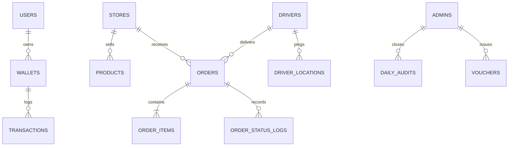

# 🏗️ Wasel Nalut: Platform Architecture & Design Specifications
# Document: 01_PLATFORM_ARCHITECTURE_AND_SPECS.md

This specification details the overall platform topology, cross-cutting technical decisions, design system token architecture, and entity relationships for **Wasel Nalut Super-App (واصل نالوت)**.

---

## 1. High-Level Architecture Topology

```mermaid
flowchart TB
    subgraph Clients["1. Application Clients"]
        CUST["📱 Customer App\nFlutter (iOS/Android/Web)\n':/app/'"]
        DRIV["🛵 Driver Captain App\nFlutter (Android/iOS)"]
        MRCH_APP["🏪 Merchant Native App\nFlutter (Android/iOS)"]
        MRCH_WEB["💻 Merchant Web KDS\nHTML5/Vanilla JS\n':/merchant'"]
        ADMN_APP["🖥 Admin Native App\nFlutter (Android/iOS/Desktop)"]
        ADMN_WEB["🛡 Admin Operations Web\nLeaflet.js + PIN Shield\n':/admin'"]
    end

    subgraph Gateway["2. Ingress & Realtime Gateway"]
        EXPRESS["⚡ Express REST Gateway\n(:3000)"]
        SOCKET["📡 Socket.io Fleet Telemetry\nRoom Broadcast Engine"]
    end

    subgraph CoreEngines["3. Core Micro-Engines"]
        LEDGER["💰 Double-Entry Escrow Ledger\n(90% Store, Delivery Fee, 10% Platform)"]
        DISPATCH["📍 Hungarian Assignment Engine\n(SciPy bipartite matching)"]
        PRICING["📈 Dynamic Surge Pricing\n(Spatial Sigmoid Curve)"]
    end

    subgraph Storage["4. Persistence & Cloud"]
        SUPABASE["🐘 Supabase PostgreSQL\nwith PostGIS Extensions"]
        MEM_DB["⚡ Seed Database Cache\n(Zero-latency local fallback)"]
        RENDER["☁️ Render Cloud Production\nhttps://wasel-nalut.onrender.com"]
    end

    CUST -->|Order REST / WebSocket| EXPRESS
    DRIV -->|GPS Pings (1.5s) / State| SOCKET
    MRCH_APP -->|KDS Status Updates| EXPRESS
    MRCH_WEB -->|Order Polling & Actions| EXPRESS
    ADMN_WEB -->|Master PIN / Dispatch| EXPRESS
    ADMN_APP -->|Z-Audit & Disputes| EXPRESS

    EXPRESS --> LEDGER
    EXPRESS --> DISPATCH
    EXPRESS --> PRICING

    EXPRESS --> SUPABASE
    EXPRESS --> MEM_DB
```

---

## 2. Libyan Localization & Business Rules

1. **Currency**:
   - Primary representation: `د.ل` (Dinar Libyi)
   - Code representation: `LYD`
   - Zero dollars: No `$` symbol anywhere in UI strings, APIs, or database records.
2. **Geographical Coordinates (Nalut Hub)**:
   - Central Nalut coordinates: `lat: 31.8687, lng: 10.9818`
   - Active Coverage Zones:
     - وسط المدينة (Nalut City Center)
     - حي سيدي خليفة (Sidi Khalifa District)
     - طريق الجبل والقلعة (Mountain & Castle Road)
     - طريق الحوامد / كاباو (Al-Hawamid / Kabaw Connector)
3. **Payment Models**:
   - **الدفع عند الاستلام (Cash on Delivery - COD)**: Default high-volume payment mode. Drivers carry cash and incur a COD balance on their wallet that must be settled via vouchers or local cash offices.
   - **محفظة واصل الرقمية (Wasel Digital Wallet)**: Internal ledger supporting deposits, store payouts, and customer refunds.
   - **Local Payment Gateways (Ready for Integration)**: سداد (Sadad), تداول (Tadawul), والمدار باي.

---

## 3. Global Design System Tokens (`design_system.dart`)

All Flutter client apps must use these standardized tokens:

### 3.1 Color Palette
```dart
class AppColors {
  // Wasel Brand Primaries
  static const Color waselPrimary   = Color(0xFFE23744); // Presto Crimson Red
  static const Color waselSecondary = Color(0xFFFF6600); // Sunset Orange
  static const Color waselPurple    = Color(0xFF7C3AED); // Mataa Royal Violet
  static const Color waselGreen     = Color(0xFF10B981); // Jet Express Emerald
  static const Color waselLight     = Color(0xFFFFECEE); // Soft Red Accent
  static const Color gold           = Color(0xFFFFB800); // Star Rating & Badges

  // Neutrals (Light Mode)
  static const Color lightBackground     = Color(0xFFF8FAFC);
  static const Color lightSurface        = Color(0xFFFFFFFF);
  static const Color lightCard           = Color(0xFFFFFFFF);
  static const Color lightBorder         = Color(0xFFE2E8F0);
  static const Color lightTextPrimary    = Color(0xFF0F172A);
  static const Color lightTextSecondary  = Color(0xFF475569);
  static const Color lightTextMuted      = Color(0xFF94A3B8);

  // Neutrals (Dark Mode)
  static const Color darkBackground      = Color(0xFF0B0F19);
  static const Color darkSurface         = Color(0xFF131B2E);
  static const Color darkCard            = Color(0xFF1E293B);
  static const Color darkBorder          = Color(0xFF334155);
  static const Color darkTextPrimary     = Color(0xFFF8FAFC);
  static const Color darkTextSecondary   = Color(0xFF94A3B8);
  static const Color darkTextMuted       = Color(0xFF64748B);

  // Status Colors
  static const Color success = Color(0xFF10B981);
  static const Color warning = Color(0xFFF59E0B);
  static const Color error   = Color(0xFFEF4444);
  static const Color info    = Color(0xFF3B82F6);
}
```

### 3.2 Typography Guidelines
- Use **Tajawal** or system sans-serif with proper RTL text direction.
- Titles: Bold/ExtraBold (800-900), sizes 18px to 26px.
- Body: Medium/Regular (400-500), sizes 13px to 15px.
- Badges & Microcopy: SemiBold (600-700), sizes 10px to 12px.

---

## 4. Entity Relationships & Core Schema Models



- **Users**: Customers, drivers, merchants, operations admins.
- **Stores**: Restaurants, groceries, bakeries, electronics vendors in Nalut.
- **Orders**: Lifecycle states: `placed` -> `accepted` -> `preparing` -> `ready_for_pickup` -> `picked_up` -> `delivered` -> `disputed` / `cancelled`.
- **Wallets & Escrow**: Double-entry financial journal preventing duplicate spending or ghost balances.
