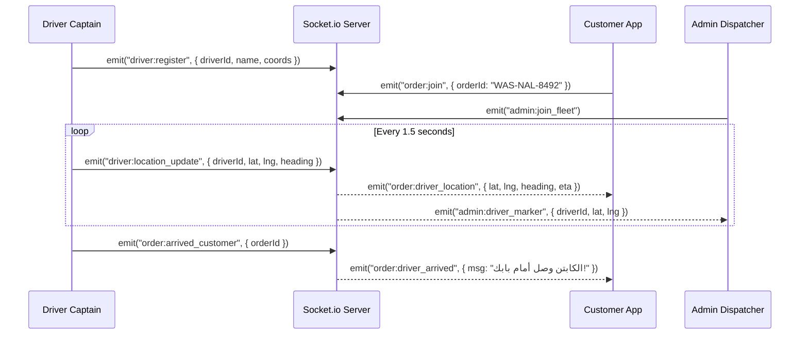

# 🔌 Wasel Nalut: Backend API, Database & Real-Time Specifications
# Document: 02_BACKEND_API_AND_DATABASE.md

This blueprint details the complete backend architecture for **Wasel Nalut Super-App**, including database DDL, REST endpoints, WebSocket events, and financial ledger logic.

---

## 1. Database Schema DDL (`backend/schema.sql`)

PostgreSQL 14+ / Supabase compatible schema:

```sql
-- Enable Extensions
CREATE EXTENSION IF NOT EXISTS "uuid-ossp";
CREATE EXTENSION IF NOT EXISTS "postgis";

-- 1. USERS & ROLES
CREATE TYPE user_role AS ENUM ('customer', 'driver', 'merchant', 'admin');

CREATE TABLE users (
    id UUID PRIMARY KEY DEFAULT uuid_generate_v4(),
    phone_number VARCHAR(20) UNIQUE NOT NULL,
    full_name VARCHAR(100) NOT NULL,
    role user_role DEFAULT 'customer',
    avatar_url TEXT,
    is_active BOOLEAN DEFAULT TRUE,
    created_at TIMESTAMP WITH TIME ZONE DEFAULT NOW()
);

-- 2. STORES & CATEGORIES
CREATE TYPE store_vertical AS ENUM ('food', 'grocery', 'marketplace');

CREATE TABLE stores (
    id VARCHAR(50) PRIMARY KEY,
    name VARCHAR(150) NOT NULL,
    vertical store_vertical DEFAULT 'food',
    district VARCHAR(100) DEFAULT 'وسط نالوت',
    latitude DOUBLE PRECISION NOT NULL,
    longitude DOUBLE PRECISION NOT NULL,
    location GEOMETRY(Point, 4326),
    rating NUMERIC(2, 1) DEFAULT 4.8,
    is_open BOOLEAN DEFAULT TRUE,
    base_delivery_fee NUMERIC(6, 2) DEFAULT 5.00,
    created_at TIMESTAMP WITH TIME ZONE DEFAULT NOW()
);

-- 3. PRODUCTS & MODIFIERS
CREATE TABLE products (
    id VARCHAR(50) PRIMARY KEY,
    store_id VARCHAR(50) REFERENCES stores(id) ON DELETE CASCADE,
    title VARCHAR(150) NOT NULL,
    description TEXT,
    base_price_lyd NUMERIC(8, 2) NOT NULL,
    image_url TEXT,
    is_available BOOLEAN DEFAULT TRUE,
    category VARCHAR(50),
    is_food BOOLEAN DEFAULT TRUE,
    created_at TIMESTAMP WITH TIME ZONE DEFAULT NOW()
);

-- 4. CAPTAINS / DRIVERS
CREATE TYPE driver_status AS ENUM ('offline', 'online', 'busy');

CREATE TABLE drivers (
    id VARCHAR(50) PRIMARY KEY,
    user_id UUID REFERENCES users(id),
    full_name VARCHAR(100) NOT NULL,
    phone VARCHAR(20) NOT NULL,
    vehicle_type VARCHAR(50) DEFAULT 'سيارة',
    plate_number VARCHAR(30),
    status driver_status DEFAULT 'offline',
    current_latitude DOUBLE PRECISION,
    current_longitude DOUBLE PRECISION,
    rating NUMERIC(2, 1) DEFAULT 4.9,
    active_orders_count INT DEFAULT 0,
    cod_balance_lyd NUMERIC(10, 2) DEFAULT 0.00,
    created_at TIMESTAMP WITH TIME ZONE DEFAULT NOW()
);

-- 5. ORDERS & TRACKING
CREATE TYPE order_status AS ENUM (
    'placed', 'accepted', 'preparing', 'ready_for_pickup',
    'picked_up', 'delivered', 'cancelled', 'disputed'
);

CREATE TABLE orders (
    id VARCHAR(50) PRIMARY KEY,
    order_number VARCHAR(20) UNIQUE NOT NULL,
    customer_id UUID REFERENCES users(id),
    customer_name VARCHAR(100),
    customer_phone VARCHAR(20),
    store_id VARCHAR(50) REFERENCES stores(id),
    store_name VARCHAR(150),
    driver_id VARCHAR(50) REFERENCES drivers(id),
    driver_name VARCHAR(100),
    status order_status DEFAULT 'placed',
    items JSONB NOT NULL,
    subtotal_lyd NUMERIC(8, 2) NOT NULL,
    delivery_fee_lyd NUMERIC(8, 2) NOT NULL,
    total_amount_lyd NUMERIC(8, 2) NOT NULL,
    delivery_address TEXT,
    delivery_lat DOUBLE PRECISION,
    delivery_lng DOUBLE PRECISION,
    otp_code VARCHAR(4) NOT NULL,
    payment_method VARCHAR(20) DEFAULT 'cod',
    prep_time_minutes INT DEFAULT 20,
    notes TEXT,
    created_at TIMESTAMP WITH TIME ZONE DEFAULT NOW(),
    updated_at TIMESTAMP WITH TIME ZONE DEFAULT NOW()
);

-- 6. DOUBLE-ENTRY LEDGER & ESCROW
CREATE TABLE wallets (
    id UUID PRIMARY KEY DEFAULT uuid_generate_v4(),
    owner_id VARCHAR(50) UNIQUE NOT NULL,
    owner_type VARCHAR(20) NOT NULL, -- 'customer', 'store', 'driver', 'platform'
    balance_lyd NUMERIC(12, 2) DEFAULT 0.00,
    escrow_locked_lyd NUMERIC(12, 2) DEFAULT 0.00,
    updated_at TIMESTAMP WITH TIME ZONE DEFAULT NOW()
);

CREATE TABLE wallet_transactions (
    id UUID PRIMARY KEY DEFAULT uuid_generate_v4(),
    order_id VARCHAR(50) REFERENCES orders(id),
    from_wallet_id UUID REFERENCES wallets(id),
    to_wallet_id UUID REFERENCES wallets(id),
    amount_lyd NUMERIC(10, 2) NOT NULL,
    transaction_type VARCHAR(50) NOT NULL, -- 'order_escrow', 'merchant_payout', 'driver_fee', 'commission'
    notes TEXT,
    created_at TIMESTAMP WITH TIME ZONE DEFAULT NOW()
);

-- 7. FINANCIAL AUDITS & VOUCHERS (Z-REPORTS)
CREATE TABLE daily_audits (
    id UUID PRIMARY KEY DEFAULT uuid_generate_v4(),
    audit_code VARCHAR(30) UNIQUE NOT NULL,
    audit_date DATE NOT NULL,
    total_orders INT DEFAULT 0,
    gmv_lyd NUMERIC(12, 2) DEFAULT 0.00,
    cash_collected_lyd NUMERIC(12, 2) DEFAULT 0.00,
    merchant_dues_lyd NUMERIC(12, 2) DEFAULT 0.00,
    captain_dues_lyd NUMERIC(12, 2) DEFAULT 0.00,
    platform_net_lyd NUMERIC(12, 2) DEFAULT 0.00,
    is_closed BOOLEAN DEFAULT FALSE,
    closed_at TIMESTAMP WITH TIME ZONE,
    notes TEXT
);

CREATE TABLE vouchers (
    id UUID PRIMARY KEY DEFAULT uuid_generate_v4(),
    voucher_number VARCHAR(30) UNIQUE NOT NULL,
    type VARCHAR(30) NOT NULL, -- 'disbursement', 'receipt', 'expense'
    beneficiary_name VARCHAR(150) NOT NULL,
    beneficiary_role VARCHAR(50) NOT NULL,
    amount_lyd NUMERIC(10, 2) NOT NULL,
    notes TEXT,
    created_at TIMESTAMP WITH TIME ZONE DEFAULT NOW()
);
```

---

## 2. REST API Specification (`backend/server.js`)

Base URL: `https://wasel-nalut.onrender.com/api/v1` (or `http://localhost:3000/api/v1`)

### 2.1 Catalog & Stores
- `GET /stores`
  - Query params: `type` (food, grocery, marketplace), `district`
  - Response: List of stores with location, rating, and open status.
- `GET /stores/:id/menu`
  - Response: Categories, products, variants, and modifier options with pricing in `د.ل`.

### 2.2 Order Lifecycle
- `POST /orders/checkout`
  - Body:
    ```json
    {
      "customerId": "usr_001",
      "customerName": "سليمان النالوتي",
      "customerPhone": "0912345678",
      "storeId": "store_nalut_01",
      "items": [
        {
          "title": "شاورما دجاج تنور نالوتي",
          "quantity": 2,
          "unitPrice": 12.00,
          "addons": ["صلصة ثومية ليبية حارة (+1.50 د.ل)"]
        }
      ],
      "subtotal": 27.00,
      "deliveryFee": 5.00,
      "totalAmount": 32.00,
      "deliveryAddress": "شارع القلعة، نالوت",
      "deliveryLat": 31.8690,
      "deliveryLng": 10.9820,
      "paymentMethod": "cod",
      "notes": "الرجاء عدم التأخير مع التغليف الساخن"
    }
    ```
  - Response: Created order with `orderNumber: "WAS-NAL-8492"`, `otpCode: "4821"`, and status `"placed"`.
- `GET /orders/:id`
  - Response: Real-time status, driver details, items, timestamps.
- `POST /orders/:id/status`
  - Body: `{ "status": "preparing" | "ready_for_pickup" | "picked_up" | "delivered", "prepTime": 25 }`
  - Triggers WebSocket broadcast to customer room and admin dispatcher.

### 2.3 Operations & Accounting
- `GET /admin/overview`
  - Response: Active orders count, live drivers count, today's GMV, cash collected.
- `GET /accounting/summary`
  - Response: Daily Z-audit figures, merchant balances, captain COD liabilities.
- `POST /disputes/resolve-noshow`
  - Body: `{ "orderId": "...", "customerAction": "blacklisted", "mealDisposal": "captain_bonus" }`
  - Releases 90% merchant compensation voucher, credits captain delivery fee, and blacklists rogue phone number.

---

## 3. Real-Time WebSocket Engine (`backend/tracking_socket_server.js`)

The fleet tracking engine runs on Socket.io and facilitates sub-second GPS telemetry and event streaming:



---

## 4. Double-Entry Escrow & Ledger Formula (`backend/wallet_service.js`)

When an order is created, completed, or disputed:

1. **Order Placement (`order_placement`)**:
   - Customer Wallet / COD Escrow $\rightarrow$ Platform Escrow: `totalAmount`
2. **Order Completion (`order_delivered`)**:
   - Platform Escrow $\rightarrow$ Merchant Wallet: $\text{subtotal} \times 0.90$ (90% store share)
   - Platform Escrow $\rightarrow$ Driver Wallet: $\text{deliveryFee}$ (100% driver delivery earnings)
   - Platform Escrow $\rightarrow$ Platform Revenue: $\text{subtotal} \times 0.10$ (10% platform commission)
3. **No-Show Dispute (`resolve_dispute`)**:
   - Platform Escrow $\rightarrow$ Merchant Compensation: $\text{subtotal} \times 0.90$
   - Platform Escrow $\rightarrow$ Driver Compensation: $\text{deliveryFee}$
   - Penalty applied to Customer Phone / Account.
