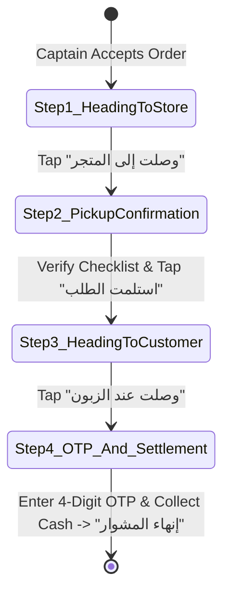

# 🛵 Wasel Nalut: Driver / Captain Mobile App Specifications
# Document: 04_FLUTTER_DRIVER_APP.md

This blueprint details the architecture and step-by-step dispatch workflow for the **Wasel Nalut Captain / Driver App (`flutter_driver_app`)**.

---

## 1. Application Architecture & Core Screens

```text
flutter_driver_app/
├── lib/
│   ├── driver_home_screen.dart          # Shift online/offline, daily earnings, COD risk indicator
│   ├── order_radar_dialog.dart          # High-urgency incoming offer modal with 15s timer
│   ├── active_delivery_flow_screen.dart # 4-step turn-by-turn delivery execution
│   ├── driver_wallet_screen.dart        # COD debt, cash deposit requests, payout ledger
│   └── main.dart                        # Driver harness entrypoint
└── pubspec.yaml
```

---

## 2. Shift Toggle & Home Screen (`driver_home_screen.dart`)

- **Online / Offline Shift Switch**:
  - Toggling Online registers driver coordinates with the central dispatch engine.
  - Toggling Offline suspends order allocation.
- **Daily Performance Card**:
  - `عدد المشاوير المكتملة (Trips Completed)`: e.g. 14 مشوار
  - `صافي أرباح التوصيل (Net Earnings)`: e.g. 70.00 د.ل
  - `الكاش بحوزتك (Cash in Hand - COD Debt)`: e.g. 350.00 د.ل
  - **COD Warning Threshold**: If cash-in-hand exceeds `500.00 د.ل`, app prompts the driver to deposit cash at the central Nalut office before accepting new orders.

---

## 3. Order Radar Dialog (`order_radar_dialog.dart`)

When an order is dispatched:
1. **Urgency Animation**: High-contrast bottom sheet popup with pulsing radar wave.
2. **Circular 15-Second Timer**:
   - `TweenAnimationBuilder` animating circular progress indicator from 15 to 0.
   - If timer expires without action, order auto-declines and dispatches to the next nearest captain.
3. **Trip Details**:
   - Store Name & District: `"مطعم قصر نالوت • شارع القلعة"`
   - Estimated Delivery Payout: `"+5.00 د.ل أجر توصيل"`
   - Estimated Distance: `"1.4 كم إلى المطعم • 2.8 كم إلى الزبون"`
   - Payment Mode: `الدفع عند الاستلام (COD)`
4. **Action Buttons**:
   - Large Green Button: `"قبول الطلب (Accept)"`
   - Red Outline Button: `"اعتذار (Decline)"`

---

## 4. 4-Step Active Delivery Workflow (`active_delivery_flow_screen.dart`)



### Stage 1: Heading to Store (التوجه للمتجر)
- Store location coordinates, address, and live distance.
- Direct store calling button (`url_launcher: tel:...`).
- CTA Button: `"وصلت إلى المتجر (Arrived at Store)"`.

### Stage 2: Order Pickup Confirmation (استلام الطلب)
- Checklist of ordered items (e.g. 2x شاورما، 1x بطاطا).
- Verification notice: `"تأكد من مطابقة الأصناف وسلامة التغليف قبل الاستلام"`.
- CTA Button: `"تأكيد الاستلام وبدء الرحلة (Confirm Pickup)"`.

### Stage 3: Heading to Customer (التوجه للزبون)
- Customer dropoff address (e.g. `"حي سيدي خليفة، بجانب المسجد العتيق"`).
- Direct customer call and WhatsApp buttons.
- CTA Button: `"وصلت لموقع الزبون (Arrived at Customer)"`.

### Stage 4: Customer OTP Verification & Cash Collection (التسليم وإدخال الكود)
- **4-Digit OTP Code Input**:
  - Driver must enter the code provided by the customer.
  - Prevents fraudulent "delivered" claims without real customer contact.
- **COD Cash Collection Banner**:
  - Clearly displays: `"المبلغ المطلوب استلامه من الزبون: 32.00 د.ل"`.
  - Checkbox: `"تم استلام المبلغ نقداً كاملاً"`.
- CTA Button: `"إتمام الطلب بنجاح (Complete Delivery)"`.

---

## 5. Driver Wallet & Cash Settlement (`driver_wallet_screen.dart`)

- **Double-Entry Financial Journal**:
  - Each trip credits delivery fee (`+5.00 د.ل`) to `driver_earnings`.
  - Each COD order debits the collected cash (`+32.00 د.ل`) to `driver_cash_debt`.
- **Settlement Process (توريد العهدة)**:
  - Driver visits Nalut operations hub or deposits via local agency.
  - Admin issues official `سند قبض (Receipt Voucher)` and updates driver balance to 0.00 د.ل.
