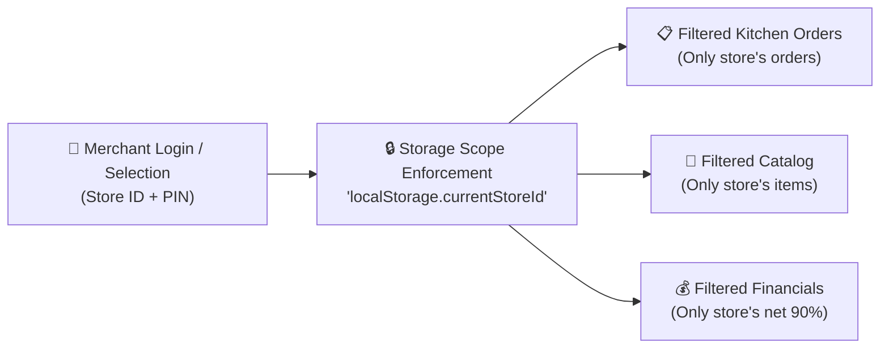

# 🏪 Wasel Nalut: Merchant KDS & Admin Operations Hub Specifications
# Document: 05_MERCHANT_AND_ADMIN_SYSTEMS.md

This specification details both native Flutter apps and production web portals for Merchants (`flutter_merchant_app`, `backend/public/merchant/index.html`) and Super Admins (`flutter_admin_app`, `backend/public/admin/index.html`).

---

## 1. Merchant Platform & Multi-Tenant Store Isolation

To ensure privacy and strict security across restaurants and retailers in Nalut:



### 1.1 Strict Isolation Rules
1. **Persistent Context**:
   - The selected store is saved in `localStorage.setItem('wasel_active_store_id', storeId)` and `sessionStorage`.
   - On page load, if no store is authenticated, a mandatory modal is displayed.
   - Any API request for orders (`/api/v1/orders`) or catalog (`/api/v1/stores/:id/menu`) is strictly filtered by the authenticated `store_id`.
2. **Switch Store Action**:
   - Merchants can securely switch stores using a dedicated modal requiring store selection and PIN confirmation.

### 1.2 Kitchen Display System (KDS) Columns
1. **طلبات جديدة (New Orders)**:
   - Plays an audio alert chime (`order_chime.mp3`) every 5 seconds until acknowledged.
   - Prep-time selector: `[15 دقيقة]` `[25 دقيقة]` `[35 دقيقة]`.
   - Action Buttons: `قبول وبدء التحضير (Accept)` or `اعتذار (Reject)`.
2. **قيد التحضير (Preparing)**:
   - Displays a live countdown timer until estimated food ready time.
   - Action Button: `الوجبة جاهزة للاستلام (Mark Ready)`.
   - Triggers automated driver arrival dispatch alert.
3. **جاهز للاستلام (Ready for Pickup)**:
   - Waiting for captain pickup.
   - Shows assigned captain name and phone number.

### 1.3 Menu & Availability Manager
- Instant toggle switches: `متوفر بالمخزون (In Stock)` / `نفذت الكمية (Out of Stock)`.
- Quick price editor in `د.ل` (e.g. update burger from 14.00 د.ل to 16.00 د.ل).

---

## 2. Admin Operations & Master Dispatch Hub

### 2.1 Master Admin Security Gate (PIN Shield: `7788`)
- The Admin Web portal (`/admin`) and Admin Flutter App (`flutter_admin_app`) are protected by a master PIN overlay.
- Default Master PIN: `7788`.
- Unauthorized visitors cannot inspect orders, driver locations, or financial data.

### 2.2 Live Fleet Radar Map (Leaflet.js / OpenStreetMap)
- Centered on Nalut (`31.8687, 10.9818`).
- Real-time animated markers:
  - 🛵 Green Scooter: Online & Available driver.
  - 🛵 Orange Scooter: Busy delivering driver.
  - 🏪 Red Building: Active partner store.
  - 📍 Blue Pin: Customer delivery destination.
- Clicking any driver marker shows phone, vehicle type, plate number, and current trip.

---

## 3. Financial Z-Audit Daily Close System (`daily_audits`)

At the end of each business day (e.g. 02:00 AM), operations admins close the financial day:

```text
============================================================
              محضر جرد الإقفال المالي اليومي Z
                    تطبيق واصل نالوت
============================================================
كود الجرد الرسمي:        Z-NALUT-2026-09-11
إجمالي عدد الطلبات:      142 طلب
إجمالي قيمة التداول (GMV): 4,970.00 د.ل
الكاش المحصل طرف الكباتن:  3,450.00 د.ل
مستحقات المتاجر (90%):    4,120.00 د.ل
أجور الكباتن المستحقة:     520.00 د.ل
صافي أرباح المنصة:        330.00 د.ل
============================================================
الحالة: تم التدقيق والمطابقة وإقفال اليومية وأرشفة السجل السحابي
```

When confirmed, the system freezes the day's records and outputs an official Z-audit voucher.

---

## 4. Dispute Resolution Chamber: Customer No-Show (`orders_tab.dart`)

When a customer does not answer their phone upon delivery:

1. **Automated Compensation Rules**:
   - **Merchant**: Compensated with 90% of order value via an automated `سند صرف (Disbursement Voucher)`.
   - **Captain**: Compensated with 100% of delivery fee (`5.00 د.ل`) for time and fuel.
2. **Penalty Enforcement**:
   - Admin options:
     - `حظر الرقم نهائياً (Blacklist)`
     - `قيد رصيد سالب (-35.00 د.ل) على رقم الهاتف`
     - `قبول العذر وإعفاء (ظرف طارئ)`
3. **Meal Disposal Protocol**:
   - `مكافأة وإكرامية للكابتن (Captain Bonus)`
   - `طرح كعرض خاطف بخصم 50% (Flash Deal)`
   - `إتلاف الوجبة وتسجيلها كتالف (Discarded)`

---

## 5. Digital Voucher Generator (`DigitalVoucherDialog.dart`)

Generates formal financial vouchers with QR verification codes:
- **سند صرف (Disbursement)**: For merchant dues settlements.
- **سند قبض (Receipt)**: For driver cash COD handovers.
- **سند مصروفات (Operational Expense)**: For platform fuel, marketing, or maintenance.
- Printable directly to standard 80mm thermal receipt printers.
