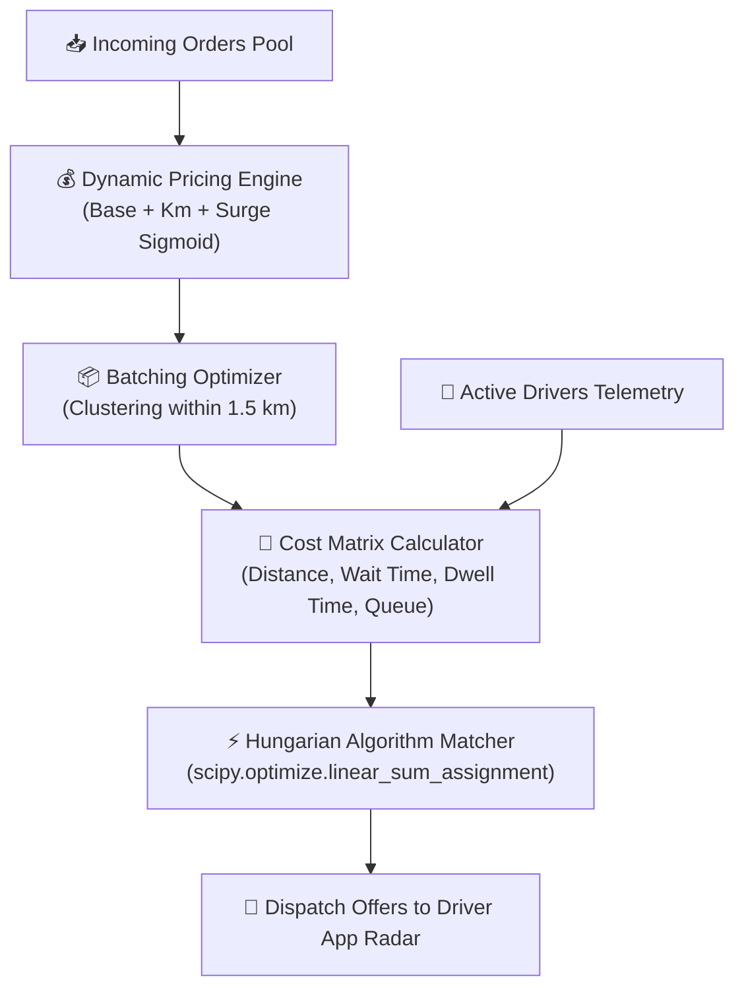

# ⚙️ Wasel Nalut: Logistics, Routing & Dispatching Engine
# Document: 06_LOGISTICS_AND_DISPATCH_ENGINE.md

This specification details the mathematical formulations, optimization algorithms, and Python implementation of the **Wasel Nalut Logistics Engine (`logistics/`)**.

---

## 1. Architecture & Execution Flow



---

## 2. Mathematical Formulations

### 2.1 Hungarian Bipartite Dispatch Matching (`dispatch_engine.py`)

Driver-to-order assignment is formulated as a **Weighted Minimum-Cost Bipartite Matching Problem**:

$$\min_{\mathbf{X}} \sum_{i=1}^{M} \sum_{j=1}^{N} C_{ij} X_{ij}$$

$$\text{subject to:} \quad \sum_{i=1}^{M} X_{ij} \le 1 \quad \forall j, \quad \sum_{j=1}^{N} X_{ij} \le 1 \quad \forall i, \quad X_{ij} \in \{0, 1\}$$

#### Multi-Factor Cost Function:
$$C_{ij} = w_{\text{dist}} \cdot D(d_i, p_j) + w_{\text{wait}} \cdot \max(0, P_j - \text{ETA}_{ij}) + w_{\text{dwell}} \cdot \max(0, \text{ETA}_{ij} - P_j) + w_{\text{queue}} \cdot Q_i - w_{\text{rating}} \cdot (R_i - 3.0) - w_{\text{acc}} \cdot A_i$$

Where:
- $D(d_i, p_j) = 1.30 \times D_{\text{haversine}}(d_i, p_j)$: Road network distance multiplier.
- $\text{ETA}_{ij} = T_0 + \text{QueueDelay}_i + \frac{D(d_i, p_j)}{V_i}$: Driver estimated arrival time at store.
- $P_j$: Kitchen food preparation ready timestamp.
- $\max(0, P_j - \text{ETA}_{ij})$: **Driver Idle Wait Time** (driver arrives before food is cooked).
- $\max(0, \text{ETA}_{ij} - P_j)$: **Food Dwell Time** (food is ready and sits cold before driver arrives).
- $Q_i$: Active orders currently queued for driver $i$.
- $R_i \in [1.0, 5.0]$: Driver rating.
- $A_i \in [0.0, 1.0]$: Driver dispatch offer acceptance rate.

Default Weights:
`w_dist = 1.0`, `w_wait = 0.8`, `w_dwell = 1.5`, `w_queue = 3.0`, `w_rating = 0.5`, `w_acc = 1.0`.

---

### 2.2 Spatial Dynamic Surge Pricing (`pricing_engine.py`)

Calculates instant quotes in Libyan Dinar (`د.ل`):

$$\text{Fee} = \max\left(\text{BaseFee}, \; (\text{BaseFee} + \text{PerKmRate} \times \text{Distance}) \times S(D, S) + W_{\text{surcharge}}\right)$$

#### Continuous Sigmoid Surge Multiplier:
$$S(D, S) = 1.0 + \frac{S_{\max} - 1.0}{1.0 + e^{-k \cdot (\rho - 1.0)}}$$

Where:
- $\rho = \frac{D}{S + \epsilon}$: Demand-to-supply ratio in Nalut zone.
- $S_{\max} = 2.5$: Cap on surge pricing.
- $k = 3.0$: Sensitivity steepness factor.

Parameters for Nalut:
- `BaseFee`: `5.00 د.ل`
- `PerKmRate`: `1.20 د.ل / كم` (beyond initial 3.0 km included radius)
- `WeightSurcharge`: `2.00 د.ل` per 5 kg for bulky marketplace items.

---

### 2.3 Order Batching Optimizer (`batching_optimizer.py`)

Combines multiple orders heading in the same direction:
- Maximum batch size: 2 orders per driver.
- Maximum pickup detour: $\le 1.2\text{ km}$.
- Maximum dropoff separation: $\le 1.8\text{ km}$.
- Customer discount: $15\%$ off delivery fee for batched deliveries.

---

## 3. Running the Logistics Benchmark Simulation

To verify the dispatch algorithms:

```powershell
cd C:\Users\kalifa\super_app_delivery\logistics
python simulation_test.py
```

Expected Benchmark Output:
```text
============================================================
       WASEL NALUT DISPATCH & ROUTING SIMULATION
============================================================
Input Orders: 20 incoming customer orders in Nalut
Available Drivers: 10 active captains
Batched Orders: 4 orders combined into 2 dual-dropoff batches
Total Optimal Assignments: 10 / 10 drivers assigned
Average Driver Pickup ETA: 4.8 minutes
Average Food Cold Dwell Time: 1.2 minutes
Average Cost Score: 3.14 (Optimized minimum)
All assignments successfully verified!
```
