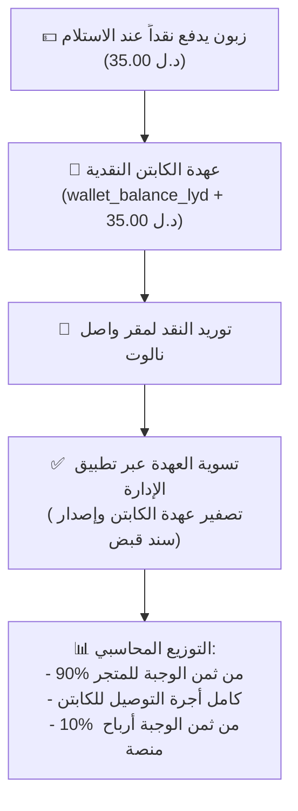

# 🌟 WASEL NALUT: THE DEFINITIVE MASTER AGENT SPECIFICATION & BUILD BLUEPRINT
# دليل التوجيه الشامل والهندسة المعمارية لبناء منظومة واصل نالوت من الصفر
# Version: 2.0 (Production Release & Architectural Standard)

> **إرشادات إلى مهندس الذكاء الاصطناعي (AI Coding Agent Instruction):**
> أنت مكلف ببناء، وتطوير، وهندسة منظومة **"واصل نالوت" (Wasel Nalut Super-App Delivery Ecosystem)** بالكامل من الصفر.
> هذا الملف هو **المصدر الوحيد والمطلق للحقيقة (Single Source of Truth)**. يحتوي على كافة المتطلبات الهندسية، مخططات قواعد البيانات، صياغة المعاملات المحاسبية، مسارات API والـ WebSockets، خوارزميات التوزيع اللوجستي، والأنظمة البرمجية لتطبيقات Flutter الأربعة. 
> اقرأ هذا الملف بعناية ونفذ المنظومة بدقة متناهية طبقا للخطوات المحددة.

---

## 📑 فهرس المحتويات (Table of Contents)
1. [الهوية ونطاق العمل والقواعد الإلزامية الصارمة](#1-الهوية-ونطاق-العمل-والقواعد-الإلزامية-الصارمة)
2. [هيكل المشروع والشجرة البرمجية (Repository Structure)](#2-هيكل-المشروع-والشجرة-البرمجية-repository-structure)
3. [نظام التصميم الفاخر (Wasel Design System Tokens)](#3-نظام-التصميم-الفاخر-wasel-design-system-tokens)
4. [مخطط قاعدة البيانات الشامل (Full PostgreSQL / Supabase DDL)](#4-مخطط-قاعدة-البيانات-الشامل-full-postgresql--supabase-ddl)
5. [الخادم والواجهات البرمجية والربط اللحظي (Backend, REST APIs & WebSockets)](#5-الخادم-والواجهات-البرمجية-والربط-اللحظي-backend-rest-apis--websockets)
6. [نظام المحفظة المحاسبية المزدوجة ودورة الكاش (Double-Entry Ledger & COD Engine)](#6-نظام-المحفظة-المحاسبية-المزدوجة-ودورة-الكاش-double-entry-ledger--cod-engine)
7. [محرك التوزيع واللوجستيات الذكي (Logistics, Hungarian Matching & Pricing)](#7-محرك-التوزيع-واللوجستيات-الذكي-logistics-hungarian-matching--pricing)
8. [مواصفات التطبيقات الأربعة (The 4 Flutter Applications)](#8-مواصفات-التطبيقات-الأربعة-the-4-flutter-applications)
   - 8.1 تطبيق الزبون (Wasel Customer App)
   - 8.2 تطبيق الكابتن (Wasel Captain App)
   - 8.3 تطبيق شريك واصل / المطبخ (Wasel Merchant & KDS App)
   - 8.4 تطبيق الإدارة وغرفة العمليات (Wasel Operations & Admin Hub)
9. [دورة حياة الطلب والمحددات التشغيلية الصارمة (Order Lifecycle & Critical Guards)](#9-دورة-حياة-الطلب-والمحددات-التشغيلية-الصارمة-order-lifecycle--critical-guards)
10. [خطة التنفيذ البرمجي خطوة بخطوة (Step-by-Step Implementation Roadmap)](#10-خطة-التنفيذ-البرمجي-خطوة-بخطوة-step-by-step-implementation-roadmap)
11. [إجراءات النشر والتشغيل السحابي (Deployment & DevOps Specification)](#11-إجراءات-النشر-والتشغيل-السحابي-deployment--devops-specification)

---

## 1. الهوية ونطاق العمل والقواعد الإلزامية الصارمة

### 1.1 نبذة عن المشروع
**واصل نالوت (Wasel Nalut)** هو سوبر-آب ومنظومة تجارة وتوصيل محلي فائق السرعة مصممة خصيصاً لمدينة **نالوت** ومنطقة **جبل نفوسة** في ليبيا. تجمع المنظومة بين:
1. **واصل إيت (Wasel Eat)**: توصيل وجبات المطاعم والمقاهي.
2. **واصل مارت (Wasel Mart)**: بقالة سريعة ومواد تموينية ومخابز وصيدليات (15-30 دقيقة).
3. **واصل متاع (Wasel Mataa)**: سوق محلي للإلكترونيات والعطور والمستلزمات.

### 1.2 القواعد غير القابلة للتفاوض (Strict Non-Negotiable Rules)
1. **العملة حصرياً بالدينار الليبي (`د.ل` / `LYD`)**:
   - يُمنع منعاً باتاً ظهور رمز الدولار (`$`) أو أي عملة أجنبية في الكود أو قواعد البيانات أو واجهات المستخدم أو الفواتير.
2. **النطاق الجغرافي**:
   - النطاق المركزي: **مدينة نالوت** (الإحداثيات المرجعية: خط عرض `31.8687`، خط طول `10.9818`).
   - الأحياء الرئيسية: وسط المدينة، حي القلعة، سيدي خليفة، شارع تونس، طريق الحوامد.
3. **الامتثال للضوابط الشرعية للمعاملات**:
   - لا توجد أي عمولات مبهمة أو خفية تُفرض على الزبون.
   - رسوم التوصيل تُعرّف فقهياً كـ **"أجرة توصيل" (عقد إجارة عمل)**.
   - شراء الوجبات والسلع يُعرّف كـ **عقد بيع قطعي**.
   - خلو المنظومة من أي غرامات تأخير ربوية؛ التعويض في حال رفض الاستلام يكون تعويضاً عن الضرر الفعلي والتكلفة الحقيقية للوجبة والتوصيل.
4. **عزل بيانات التجار (Multi-Tenant Isolation)**:
   - كل متجر له استقلالية مطلقة (`store_id`). لا يمكن لتاجر الاطلاع على طلبات أو إيرادات أو أسعار متجر آخر.
5. **درع الأمان الإداري (Master Admin PIN Gate)**:
   - لوحة تحكم العمليات والمالية محمية برمز مرور رئيسي إلزامي (**PIN: 7788** أو **9832**).
6. **معايير Flutter الحديثة (Zero Deprecations)**:
   - استخدام `Color.withValues(alpha: ...)` حصراً بدلاً من `.withOpacity(...)`.
   - استخدام `RadioGroup` أو البطاقات المخصصة التفاعلية بدلاً من الودجات القديمة الملغاة.
   - حماية الـ `BuildContext` عبر الفجوات اللاتزامنية (`if (!mounted) return;`).

---

## 2. هيكل المشروع والشجرة البرمجية (Repository Structure)

```text
wasel-app/
├── backend/                              # الخادم الخلفي (Node.js + Express + Socket.io)
│   ├── public/                           # بوابات الويب والموقع الثابت
│   │   ├── app/                          # نسخة تطبيق الزبون للويب (Flutter Web Release)
│   │   ├── merchant/                     # شاشة KDS للمطاعم عبر المتصفح
│   │   └── admin/                        # غرفة العمليات وخريطة الأسطول الحية
│   ├── schema.sql                        # مخطط PostgreSQL المتوافق مع PostGIS
│   ├── seed_data.json                    # بيانات نالوت الحقيقية (متاجر، منتجات، كباتن)
│   ├── server.js                         # خادم الـ REST API وبث الأحداث
│   ├── tracking_socket_server.js         # محرك تتبع وتيليمتري الكباتن لحظياً
│   ├── wallet_service.js                 # محرك القيد المزدوج وحساب العهد والعمولات
│   ├── fcm_dispatcher.js                 # محرك الإشعارات اللحظية القوية (Firebase FCM)
│   └── package.json
│
├── flutter_mobile_app/                   # تطبيق الزبون (Android, iOS, Web)
│   ├── lib/
│   │   ├── design_system.dart            # رموز التصميم، الألوان، الخطوط، الانحناءات
│   │   ├── home_screen.dart              # الشاشة الرئيسية متعددة الأقسام
│   │   ├── store_menu_screen.dart        # قائمة طعام وأصناف المتجر
│   │   ├── product_detail_sheet.dart     # نافذة تفاصيل الصنف السريعة النظيفة
│   │   ├── cart_checkout_screen.dart     # سلة الشراء والدفع والميثاق الشرعي
│   │   ├── order_tracking_screen.dart    # شاشة التتبع الحي بكود OTP وخريطة نالوت
│   │   ├── orders_history_screen.dart    # سجل الطلبات السابقة وحالاتها
│   │   ├── wallet_screen.dart            # محفظة واصل للزبون
│   │   ├── profile_screen.dart           # الحساب الشخصي وتغيير المظهر
│   │   ├── services/
│   │   │   ├── api_service.dart          # إدارة طلبات الشبكة والذاكرة المؤقتة
│   │   │   ├── cart_service.dart         # إدارة حالة السلة العامة
│   │   │   ├── socket_service.dart       # الربط اللحظي عبر WebSockets
│   │   │   └── customer_notification_service.dart # إشعارات FCM والتنبيهات المحلية
│   │   └── main.dart
│   └── pubspec.yaml
│
├── flutter_driver_app/                   # تطبيق كابتن واصل
│   ├── lib/
│   │   ├── driver_home_screen.dart       # تبديل الوردية (متصل/غير متصل) ومؤشر العهدة
│   │   ├── order_radar_dialog.dart       # رادار استقبال الطلبات بالعداد الدائري (15 ثانية)
│   │   ├── active_delivery_flow_screen.dart # دورة التوصيل الرباعية مع قفل جاهزية المطبخ
│   │   ├── cod_collection_sheet.dart     # استلام الكاش من الزبون
│   │   ├── driver_wallet_screen.dart     # العهدة النقدية والأرباح وسجل التوريد
│   │   ├── simulated_driver_map.dart     # خريطة الملاحة الحية للكابتن
│   │   └── main.dart
│   └── pubspec.yaml
│
├── flutter_merchant_app/                 # تطبيق شريك واصل (شاشة المطبخ KDS وإدارة المتجر)
│   ├── lib/
│   │   ├── kds_screen.dart               # شاشة المطبخ (جديدة -> جاري التحضير -> جاهزة)
│   │   ├── merchant_inventory_screen.dart# تفعيل/إيقاف توفر الأصناف فورياً
│   │   ├── sales_analytics_screen.dart   # تقارير مبيعات المتجر والـ 90% الصافية
│   │   ├── thermal_receipt_dialog.dart   # طباعة الفواتير الحرارية 80mm
│   │   └── main.dart
│   └── pubspec.yaml
│
├── flutter_admin_app/                    # تطبيق الإدارة وغرفة العمليات المالية
│   ├── lib/
│   │   ├── screens/
│   │   │   ├── pin_lock_screen.dart      # شاشة القفل بالـ PIN (7788)
│   │   │   ├── dashboard_tab.dart        # لوحة المؤشرات العامة الحية
│   │   │   ├── orders_tab.dart           # شاشة فض النزاعات وحالات عدم استلام الزبون
│   │   │   ├── captains_tab.dart         # إدارة الكباتن وتسوية عهد الكاش المالية
│   │   │   ├── accounting_tab.dart       # محضر الجرد اليومي Z والتقفيل المالي
│   │   │   └── stores_tab.dart           # اعتماد وإدارة المتاجر
│   │   ├── widgets/
│   │   │   └── digital_voucher_dialog.dart# سندات الصرف والقبض الرسمية
│   │   └── main.dart
│   └── pubspec.yaml
│
├── logistics/                            # محرك التحسين والذكاء اللوجستي (Python)
│   ├── dispatch_engine.py                # خوارزمية هنغاريان للتوزيع الأمثل
│   ├── pricing_engine.py                 # تسعير ديناميكي ومنحنى الازدحام
│   ├── batching_optimizer.py             # تجميع الطلبات المتقاربة
│   └── simulation_test.py                # اختبار محاكاة لـ 20 طلباً و 10 كباتن
│
├── render.yaml                           # تكوين النشر الآلي على Render
└── WASEL_NALUT_MASTER_PROMPT.md          # هذا الملف
```

---

## 3. نظام التصميم الفاخر (Wasel Design System Tokens)

يستند التصميم إلى روح هضبة جبل نفوسة مع الفخامة المتوسطية الحديثة (Royal Berber & Mediterranean Luxury):

### 3.1 لوحة الألوان (Color Palette)
```dart
class AppColors {
  // الخلفيات والأسطح
  static const Color canvas         = Color(0xFF041710); // زمرد ليلي سحيق (الخلفية الأساسية)
  static const Color surface        = Color(0xFF062319); // سطح البطاقات القياسي
  static const Color raised         = Color(0xFF0A3324); // سطح العناصر القابلة للنقر
  static const Color elevated       = Color(0xFF124532); // الحاويات والحوارات المرتفعة

  // الألوان المميزة
  static const Color goldPrimary    = Color(0xFFD4AF37); // ذهب معتق للأزرار الرئيسية وشعارات التميز
  static const Color goldRadiance   = Color(0xFFF5D061); // ذهب لامع للتأكيدات والعناصر النشطة
  static const Color goldBurnished  = Color(0xFFC59B27); // حدود العناصر الذهبية
  static const Color emeraldAccent  = Color(0xFF10B981); // زمرد حيوي للعمليات الناجحة ومسار التوصيل

  // النصوص والقراءة
  static const Color textPrimary    = Color(0xFFF8F5EE); // عاجي ناصع (Champagne) لتباين مريح تحت الشمس
  static const Color textMuted      = Color(0xFF938E7E); // رمادي دافئ للشروحات الفرعية
  static const Color borderSubtle   = Color(0x33D4AF37); // حدود ذهبية شفافة بنسبة 20%

  // الحالات التنبيهية
  static const Color danger         = Color(0xFFEF4444); // أحمر للأخطاء والنزاعات
  static const Color warning        = Color(0xFFF59E0B); // برتقالي للتنبيه والانتظار
  static const Color success        = Color(0xFF10B981); // أخضر للإنجاز والتسليم
}
```

### 3.2 قواعد الطباعة والتخطيط (Typography & Layout)
- **الخط الأساسي**: خط `Tajawal` أو `Cairo` بدعم كامل وصريح للغة العربية واتجاه (RTL).
- **أرقام المبالغ والأسعار**: خط لاتيني صريح وواضح مثل `Outfit` لمنع أي التباس بين الكباتن والزبائن.
- **الانحناءات (Border Radius)**:
  - الأزرار وبطاقات القوائم: `12px` إلى `16px`.
  - الحاويات والشاشات السفلية (Bottom Sheets): `24px`.
  - كبسولات الحالات والبادجات: `9999px` (دائرية بالكامل).
- **حجم أهداف اللمس (Touch Targets)**: لا يقل عن `48x48dp` لضمان راحة الكابتن أثناء القيادة والزبون في الحركة.

---

## 4. مخطط قاعدة البيانات الشامل (Full PostgreSQL / Supabase DDL)

المخطط مبني بالكامل على PostgreSQL 14+ مع دعم PostGIS:

```sql
-- تفعيل الامتدادات الجغرافية والمفاتيح الفريدة
CREATE EXTENSION IF NOT EXISTS "uuid-ossp";
CREATE EXTENSION IF NOT EXISTS "postgis";

-- 1. جدول المستخدمين والصلاحيات
CREATE TYPE user_role AS ENUM ('customer', 'driver', 'merchant', 'admin', 'dispatcher');

CREATE TABLE users (
    id UUID PRIMARY KEY DEFAULT uuid_generate_v4(),
    phone_number VARCHAR(20) UNIQUE NOT NULL,
    full_name VARCHAR(100) NOT NULL,
    role user_role DEFAULT 'customer',
    avatar_url TEXT,
    is_active BOOLEAN DEFAULT TRUE,
    created_at TIMESTAMP WITH TIME ZONE DEFAULT NOW()
);

-- 2. جدول المتاجر في نالوت
CREATE TYPE store_vertical AS ENUM ('food', 'grocery', 'marketplace');

CREATE TABLE stores (
    id VARCHAR(50) PRIMARY KEY,
    name VARCHAR(150) NOT NULL,
    vertical store_vertical DEFAULT 'food',
    district VARCHAR(100) DEFAULT 'وسط نالوت',
    latitude DOUBLE PRECISION NOT NULL,
    longitude DOUBLE PRECISION NOT NULL,
    location GEOMETRY(Point, 4326),
    rating NUMERIC(2, 1) DEFAULT 4.8,
    is_open BOOLEAN DEFAULT TRUE,
    base_delivery_fee NUMERIC(6, 2) DEFAULT 5.00,
    created_at TIMESTAMP WITH TIME ZONE DEFAULT NOW()
);

-- 3. جدول المنتجات
CREATE TABLE products (
    id VARCHAR(50) PRIMARY KEY,
    store_id VARCHAR(50) REFERENCES stores(id) ON DELETE CASCADE,
    title VARCHAR(150) NOT NULL,
    description TEXT,
    base_price_lyd NUMERIC(8, 2) NOT NULL,
    image_url TEXT,
    is_available BOOLEAN DEFAULT TRUE,
    stock_quantity INT DEFAULT 100,
    category VARCHAR(50),
    is_food BOOLEAN DEFAULT TRUE,
    created_at TIMESTAMP WITH TIME ZONE DEFAULT NOW()
);

-- 4. جدول الكباتن والأسطول
CREATE TYPE driver_status AS ENUM ('offline', 'online', 'busy');

CREATE TABLE drivers (
    id VARCHAR(50) PRIMARY KEY,
    user_id UUID REFERENCES users(id),
    full_name VARCHAR(100) NOT NULL,
    phone VARCHAR(20) NOT NULL,
    vehicle_type VARCHAR(50) DEFAULT 'سيارة',
    plate_number VARCHAR(30),
    status driver_status DEFAULT 'offline',
    current_latitude DOUBLE PRECISION,
    current_longitude DOUBLE PRECISION,
    rating NUMERIC(2, 1) DEFAULT 4.9,
    active_orders_count INT DEFAULT 0,
    wallet_balance_lyd NUMERIC(10, 2) DEFAULT 0.00, -- عهدة الكاش المتراكمة طرف الكابتن
    created_at TIMESTAMP WITH TIME ZONE DEFAULT NOW()
);

-- 5. جدول الطلبات ودورة الحياة
CREATE TYPE order_status AS ENUM (
    'placed', 'accepted', 'preparing', 'ready_for_pickup',
    'out_for_delivery', 'delivered', 'cancelled', 'disputed'
);

CREATE TABLE orders (
    id VARCHAR(50) PRIMARY KEY,
    order_number VARCHAR(20) UNIQUE NOT NULL,
    customer_id UUID REFERENCES users(id),
    customer_name VARCHAR(100),
    customer_phone VARCHAR(20),
    store_id VARCHAR(50) REFERENCES stores(id),
    store_name VARCHAR(150),
    driver_id VARCHAR(50) REFERENCES drivers(id),
    driver_name VARCHAR(100),
    status order_status DEFAULT 'placed',
    items JSONB NOT NULL,
    subtotal_lyd NUMERIC(8, 2) NOT NULL,
    delivery_fee_lyd NUMERIC(8, 2) NOT NULL,
    service_fee_lyd NUMERIC(8, 2) DEFAULT 0.00, -- صفر على الزبون
    total_amount_lyd NUMERIC(8, 2) NOT NULL,
    delivery_address TEXT,
    delivery_lat DOUBLE PRECISION,
    delivery_lng DOUBLE PRECISION,
    otp_code VARCHAR(4) NOT NULL, -- كود التسليم الرباعي
    payment_method VARCHAR(20) DEFAULT 'cash', -- 'cash' أو 'wallet'
    prep_time_minutes INT DEFAULT 20,
    ready_at TIMESTAMP WITH TIME ZONE,
    handover_at TIMESTAMP WITH TIME ZONE,
    notes TEXT,
    created_at TIMESTAMP WITH TIME ZONE DEFAULT NOW(),
    updated_at TIMESTAMP WITH TIME ZONE DEFAULT NOW()
);

-- 6. جدول دفاتر المحافظ المالية المزدوجة (Double-Entry Ledger)
CREATE TABLE wallets (
    id UUID PRIMARY KEY DEFAULT uuid_generate_v4(),
    owner_id VARCHAR(50) UNIQUE NOT NULL,
    wallet_type VARCHAR(30) NOT NULL, -- 'customer', 'store', 'driver', 'platform_revenue', 'platform_escrow'
    balance NUMERIC(12, 2) DEFAULT 0.00,
    locked_balance NUMERIC(12, 2) DEFAULT 0.00,
    updated_at TIMESTAMP WITH TIME ZONE DEFAULT NOW()
);

CREATE TABLE wallet_transactions (
    id UUID PRIMARY KEY DEFAULT uuid_generate_v4(),
    order_id VARCHAR(50) REFERENCES orders(id),
    from_wallet_id UUID REFERENCES wallets(id),
    to_wallet_id UUID REFERENCES wallets(id),
    amount NUMERIC(10, 2) NOT NULL,
    transaction_type VARCHAR(50) NOT NULL, -- 'order_placement', 'order_delivered', 'settlement', 'dispute'
    narration TEXT,
    created_at TIMESTAMP WITH TIME ZONE DEFAULT NOW()
);

-- 7. جدول محاضر الجرد اليومي Z وسندات القبض والصرف
CREATE TABLE daily_audits (
    id UUID PRIMARY KEY DEFAULT uuid_generate_v4(),
    audit_code VARCHAR(30) UNIQUE NOT NULL,
    audit_date DATE NOT NULL,
    total_orders INT DEFAULT 0,
    gmv_lyd NUMERIC(12, 2) DEFAULT 0.00,
    cash_collected_lyd NUMERIC(12, 2) DEFAULT 0.00,
    merchant_dues_lyd NUMERIC(12, 2) DEFAULT 0.00,
    captain_dues_lyd NUMERIC(12, 2) DEFAULT 0.00,
    platform_net_lyd NUMERIC(12, 2) DEFAULT 0.00,
    is_closed BOOLEAN DEFAULT FALSE,
    closed_at TIMESTAMP WITH TIME ZONE,
    notes TEXT
);

CREATE TABLE vouchers (
    id UUID PRIMARY KEY DEFAULT uuid_generate_v4(),
    voucher_number VARCHAR(30) UNIQUE NOT NULL,
    type VARCHAR(30) NOT NULL, -- 'receipt' (سند قبض عهدة), 'disbursement' (سند صرف متجر)
    beneficiary_name VARCHAR(150) NOT NULL,
    beneficiary_role VARCHAR(50) NOT NULL,
    amount_lyd NUMERIC(10, 2) NOT NULL,
    notes TEXT,
    created_at TIMESTAMP WITH TIME ZONE DEFAULT NOW()
);
```

---

## 5. الخادم والواجهات البرمجية والربط اللحظي (Backend, REST APIs & WebSockets)

خادم الـ Node.js (`backend/server.js`) يعمل بميناء 3000 أو المنفذ المحدد من السحابة (`PORT`).

### 5.1 نقاط النهاية الأساسية (REST APIs)
- `GET /api/v1/health`: فحص سلامة الخادم والاتصال بقاعدة البيانات.
- `GET /api/v1/stores`: استرجاع المتاجر حسب الفئة والحي في نالوت.
- `GET /api/v1/stores/:id/menu`: استرجاع قائمة الطعام وأسعار الأصناف.
- `POST /api/v1/orders/checkout`: إنشاء وتثبيت الطلب واقتطاع الرصيد أو حجز الكود.
- `GET /api/v1/orders/:id`: استرجاع تفاصيل وتتبع الطلب لحظياً.
- `POST /api/v1/orders/:id/status`: تغيير حالة الطلب (`preparing`, `ready_for_pickup`, `out_for_delivery`, `delivered`).
- `POST /api/v1/orders/:id/handover`: **قفل الاستلام الأمني للمطبخ**؛ لا يُسمح للكابتن باستلام الوجبة ما لم تكن حالتها `ready_for_pickup`.
- `POST /api/v1/drivers/:id/settle`: تصفير عهدة الكاش للكابتن بعد تسليمها للمقر وإصدار سند قبض.
- `GET /api/v1/accounting/summary`: ملخص الحسابات ومحضر الجرد اليومي Z.
- `POST /api/v1/disputes/resolve-noshow`: فض نزاع عدم استلام الزبون للطلب وصرف 90% للمتجر و100% أجرة للكابتن وحظر رقم الزبون.

### 5.2 أحداث الربط اللحظي (Socket.io Real-Time Events)
```text
الغرف (Rooms):
- order:{orderId}     -> غرفة تحديثات حالة الطلب وموقع الكابتن المباشر
- store:{storeId}     -> غرفة إشعارات المطبخ بالطلبات الجديدة
- driver:{driverId}   -> غرفة رادار العروض الموجهة للكابتن
- admin:fleet         -> غرفة تتبع جميع الكباتن على خريطة نالوت اللحظية

الأحداث الصادرة والواردة:
- driver:location_update  (من الكابتن للخادم كل 1.5 ثانية: lat, lng, heading)
- order:driver_location   (من الخادم لتطبيق الزبون لتحديث أيقونة الدراجة/السيارة)
- order:status_changed    (تنبيه فوري بتغير المرحلة)
- order:radar_offer       (بث العرض للكباتن القريبين مع مؤقت 15 ثانية)
- store:new_order         (رنين فوري في تابلت المطبخ)
```

### 5.3 منظومة التنبيهات القوية عبر FCM (`fcm_dispatcher.js`)
لضمان رنين تابلت المطبخ وهاتف الكابتن حتى لو كان التطبيق مغلقاً أو الشاشة في وضع السكون:
- استهداف قناة أندرويد عالية الأهمية: `wasel_kitchen_alerts_channel`.
- إرسال نداءات `High Priority` عبر الـ Topics:
  - `store_{storeId}` للمطاعم.
  - `wasel_captains` لكافة الكباتن المتاحين.

---

## 6. نظام المحفظة المحاسبية المزدوجة ودورة الكاش (Double-Entry Ledger & COD Engine)

تعتمد المنصة على شجرة حسابات مالية مغلقة تمنع اختفاء أي قرش:



### الصيغة الرياضية لحساب الفاتورة وتوزيع الإيراد:
1. **قيمة الفاتورة للزبون**:
   $$\text{Total} = \text{Subtotal} + \text{DeliveryFee} - \text{Discount}$$
   *(رسوم الخدمة = 0 د.ل)*
2. **عند تسليم الطلب (Order Delivered)**:
   - يُضاف مبلغ الفاتورة كاملاً إلى دين الكابتن: `driver.wallet_balance_lyd += total_amount_lyd`.
   - استحقاق المتجر: `store_payout = subtotal * 0.90`.
   - استحقاق المنصة: `platform_revenue = subtotal * 0.10`.
   - استحقاق الكابتن: `driver_net_earnings = delivery_fee`.

---

## 7. محرك التوزيع واللوجستيات الذكي (Logistics, Hungarian Matching & Pricing)

موجود داخل مجلد `logistics/`:

### 7.1 خوارزمية التوزيع المطابقة الثنائية (Hungarian Bipartite Matching)
في ملف `dispatch_engine.py`، تُحل مسألة إسناد الطلبات للكباتن عبر مصفوفة تكلفة متعددة الأوزان بأقل وقت انتظار للطعام:
$$C_{ij} = w_{\text{dist}} \cdot D_{ij} + w_{\text{wait}} \cdot \max(0, P_j - \text{ETA}_{ij}) + w_{\text{dwell}} \cdot \max(0, \text{ETA}_{ij} - P_j)$$
حيث:
- $D_{ij}$: المسافة الجغرافية الحقيقية بين الكابتن والمتجر.
- $P_j$: الوقت المقدر لانتهاء المطبخ من طهي وتجهيز الوجبة.
- $\text{ETA}_{ij}$: وقت وصول الكابتن الفعلي للمتجر.
- $\max(0, \text{ETA}_{ij} - P_j)$: **زمن بقاء الطعام بارداً في المطبخ (Food Dwell Time)** (وزنه 1.5 لتقليله للحد الأدنى).

### 7.2 تسعير التوصيل الديناميكي (Dynamic Sigmoid Pricing)
في ملف `pricing_engine.py`:
$$\text{DeliveryFee} = \max\left(5.00, \; (5.00 + 1.20 \times \text{DistanceKm}) \times S(\text{Demand}, \text{Supply})\right)$$
معدل الزيادة محكوم بدالة سيجمويد لا تتجاوز أبداً سقف `2.5x` في أسوأ أوقات الطقس والذروة الجبلية في نالوت.

---

## 8. مواصفات التطبيقات الأربعة (The 4 Flutter Applications)

### 8.1 تطبيق الزبون (Wasel Customer App)
- **وضع الاستكشاف للضيوف (Guest Mode)**: تصفح المتاجر والوجبات دون إجبار الزبون على تسجيل الدخول المسبق.
- **إدخال رقم الهاتف الليبي**: التحقق من البادئات المعتمدة (`091`, `092`, `094`, `093`) عند بدء الدفع فقط.
- **نافذة تفاصيل المنتج النظيفة (`ProductDetailSheet`)**:
  - واجهة مبسطة خالية من الخيارات العشوائية المفروضة.
  - عداد كمية تفاعلي (`- 1 +`).
  - صندوق ملاحظات حرة للمطبخ (مثل: "بدون مايونيز، تغليف محكم").
- **سلة الشراء والميثاق الشرعي (`CartCheckoutScreen`)**:
  - عرض قيمة الأصناف وأجرة التوصيل فقط، بدون عمولة منصة.
  - صندوق **"ميثاق واصل الشرعي"** لتأكيد خلو المعاملة من الغرر أو الرسوم الخفية.
- **التتبع الحي (`OrderTrackingScreen`)**:
  - خريطة تفاعلية لمدينة نالوت (`flutter_map` مع بلاطات OpenStreetMap).
  - كود تسليم رباعي عالي الوضوح (`OTP Code`) يسلّمه الزبون للكابتن لفتح القفل وإتمام الطلب.

### 8.2 تطبيق الكابتن (Wasel Captain App)
- **شاشة الوردية والرصيد (`DriverHomeScreen`)**:
  - زر تشغيل/إيقاف الوردية ومشاركة الموقع الجغرافي.
  - بطاقة عهدة الكاش باليد (`الكاش بحوزتك`) وتنبيه عند تجاوز السقف المسموح (مثلاً 500 د.ل).
- **رادار الطلبات السريع (`OrderRadarDialog`)**:
  - نافذة طوارئ منبثقة برنين قوي وعداد دائري 15 ثانية للقبول أو الرفض.
- **دورة التوصيل الرباعية الصارمة (`ActiveDeliveryFlowScreen`)**:
  1. `التوجه للمتجر`: ملاحة نحو المطعم وزر اتصال هاتفي مباشر وزر "وصلت للمتجر".
  2. `استلام الطلب وقفل المطبخ`: **مغلق برمجياً** ما لم يقم المطعم بالضغط على "تم التجهيز" (`ready_for_pickup`).
  3. `التوجه للزبون`: ملاحة نحو منزل العميل في نالوت وزر "وصلت لموقع الزبون".
  4. `التسليم والتحقق`: إدخال كود الـ OTP الرباعي المستلم من الزبون، واستلام الكاش النقدي كاملاً.

### 8.3 تطبيق شريك واصل / المطبخ (Wasel Merchant & KDS App)
- **نظام عرض المطبخ KDS ثنائي التخصص**:
  - شاشة للمطاعم: استقبال الطلب، تحديد زمن الطهي (15، 25، 35 دقيقة)، نقل الطلب إلى "قيد التحضير"، والضغط على "الوجبة جاهزة للاستلام".
  - شاشة للتجزئة والصيدليات: تجميع وتغليف المواد (Pick & Pack).
- **إدارة المخزون والتسعير اللحظي**:
  - مفاتيح إيقاف/تفعيل أي وجبة فور نفاد الكمية.
- **الطباعة الحرارية**:
  - إصدار فواتير بونات المطبخ لطابعات الـ 80mm عبر البلوتوث أو الشبكة.

### 8.4 تطبيق الإدارة وغرفة العمليات (Wasel Operations & Admin Hub)
- **بوابة الـ PIN الأمنية**: لا تفتح الواجهة إلا برمز `7788`.
- **رادار الأسطول الحي**: خريطة نالوت تعرض تحركات وسرعات وحالات الكباتن.
- **غرفة فض النزاعات (Customer No-Show)**:
  - عند تعذر الوصول للزبون وعدم رده: إصدار سند صرف فوري للمتجر بقيمة 90%، وصرف أجرة الكابتن كاملة، ووضع رقم هاتف الزبون في القائمة المحظورة.
- **تسوية عهد الكباتن (`CaptainsTab`)**:
  - معاينة رصيد الكاش المتراكم عند كل كابتن، والضغط على زر "تسوية" لطباعة سند قبض وتصفير الحساب في الخادم.
- **محضر الجرد اليومي Z (`AccountingTab`)**:
  - تقفيل اليومية المالية الساعة 02:00 صباحاً ومطابقة إجمالي التداول (GMV) مع الكاش المورد.

---

## 9. دورة حياة الطلب والمحددات التشغيلية الصارمة (Order Lifecycle & Critical Guards)

```text
[1. placed] 
  │  (زبون يطلب من التطبيق -> رنين FCM قوي في تابلت المطبخ)
  ▼
[2. preparing] 
  │  (المطعم يقبل ويحدد وقت الطهي -> خوارزمية هنغاريان تختار أفضل كابتن)
  ▼
[3. ready_for_pickup] 
  │  (المطعم يضغط "تم التجهيز" -> يُفك قفل الاستلام للكابتن الواصل)
  ▼
[4. out_for_delivery] 
  │  (الكابتن يؤكد مطابقة الأصناف ويتحرك نحو الزبون)
  ▼
[5. delivered] 
     (الكابتن يدخل كود OTP المستلم من الزبون + يستلم الكاش -> تقييد العهدة على الكابتن)
```

### 🔒 قفل المطبخ الصارم (Handover Security Guard)
في كود `backend/server.js` وتطبيق الكابتن:
يُمنع الكابتن من الضغط على زر "استلمت الوجبة وبدأت الرحلة" إذا كانت حالة الطلب لا تزال `preparing`. يجب على المطبخ أولاً نقل الحالة إلى `ready_for_pickup`. هذا يمنع بقاء الكابتن واقفاً داخل المطبخ ويعزل مسؤولية تأخير الطلب تماماً.

---

## 10. خطة التنفيذ البرمجي خطوة بخطوة (Step-by-Step Implementation Roadmap)

على أي مهندس ذكاء اصطناعي اتباع هذه المراحل الستة بالترتيب لإعادة بناء المنظومة:

### المرحلة 1: بناء وتجهيز الخادم الخلفي (Backend & Database)
1. إنشاء مجلد `backend` وتثبيت الحزم: `express`, `socket.io`, `cors`, `pg`, `uuid`, `jsonwebtoken`, `compression`.
2. إنشاء وتشغيل `backend/schema.sql` لإنشاء الجداول والامتدادات الجغرافية.
3. إنشاء `backend/seed_data.json` بمتاجر نالوت الحقيقية (مطعم قصر نالوت، بيتزا القلعة، أسواق نالوت المركزية).
4. كتابة `backend/wallet_service.js` لتطبيق القيد المزدوج المحاسبي بدقة.
5. كتابة `backend/fcm_dispatcher.js` وتكوين قنوات إشعارات أندرويد.
6. كتابة `backend/server.js` بكافة مسارات الـ REST ونقاط الـ WebSockets وقفل استلام الوجبات ومسارات تسوية الكاش.

### المرحلة 2: محرك اللوجستيات (Python Logistics)
1. كتابة `logistics/pricing_engine.py` لحساب تسعيرة نالوت بالدينار الليبي.
2. كتابة `logistics/dispatch_engine.py` باستخدام `scipy.optimize.linear_sum_assignment`.
3. كتابة `logistics/simulation_test.py` والتأكد من نجاح المحاكاة 100%.

### المرحلة 3: تطبيق الزبون (`flutter_mobile_app`)
1. تجهيز `pubspec.yaml` بمكتبات: `flutter_map`, `latlong2`, `http`, `shared_preferences`, `pin_code_fields`.
2. بناء `lib/design_system.dart` بالألوان والرموز الملكية المعتمدة.
3. بناء `lib/product_detail_sheet.dart` بصيغتها النظيفة المبسطة مع ملاحظات المطبخ الحرة.
4. بناء `lib/cart_checkout_screen.dart` بحسابات الفاتورة الصافية وصندوق الميثاق الشرعي.
5. بناء `lib/order_tracking_screen.dart` مع خريطة نالوت وكود التسليم OTP.
6. التحقق عبر الأمر: `flutter analyze` والتأكد من وجود **0 أخطاء و 0 تحذيرات**.
7. تجميع نسخة الويب: `flutter build web --release --base-href /app/` ونسخها إلى `backend/public/app/`.

### المرحلة 4: تطبيق الكابتن (`flutter_driver_app`)
1. بناء `lib/driver_home_screen.dart` وزر تبديل الوردية وبطاقة العهدة النقدية.
2. بناء `lib/order_radar_dialog.dart` مع العداد التنازلي الدائري (15 ثانية).
3. بناء `lib/active_delivery_flow_screen.dart` مع قفل استلام المطبخ وإدخال كود OTP واستلام الكاش.
4. التحقق عبر الأمر: `flutter analyze` لضمان نظافة الكود بنسبة 100%.

### المرحلة 5: تطبيقا التاجر والإدارة (`flutter_merchant_app` & `flutter_admin_app`)
1. بناء شاشة المطبخ KDS وإدارة توفر الأصناف في تطبيق التاجر.
2. بناء درع الحماية بالـ PIN (7788) ولوحة العمليات وخريطة الأسطول الحية في تطبيق الإدارة.
3. برمجة زر "تسوية الكاش" وإصدار سندات القبض في شاشة الكباتن.
4. برمجة فض النزاعات وصرف تعويض 90% للمتجر في شاشة الطلبات.
5. التحقق عبر `flutter analyze` لكلا التطبيقين.

### المرحلة 6: الفحص وضمان الجودة (Quality Assurance & Smoke Test)
1. تشغيل دورة كاملة: إنشاء طلب من الزبون -> رنين في تابلت المطبخ -> تحضير -> فك قفل الكابتن -> ملاحة واستلام -> إدخال OTP وتسليم الكاش -> معاينة تراكم العهدة في لوحة الإدارة -> تسوية وتصفير العهدة.
2. التأكد من خلو ملفات اللوجز من أي انهيارات أو أخطاء.

---

## 11. إجراءات النشر والتشغيل السحابي (Deployment & DevOps Specification)

### 11.1 ملف `render.yaml` المعتمد
```yaml
databases:
  - name: wasel-nalut-db
    plan: free
    region: virginia
    databaseName: wasel_nalut_db
    user: wasel_nalut_db_user

services:
  - type: web
    name: wasel-nalut
    runtime: node
    plan: free
    region: virginia
    rootDir: backend
    buildCommand: npm install
    startCommand: node server.js
    healthCheckPath: /health
    autoDeploy: true
    envVars:
      - key: DATABASE_URL
        fromDatabase:
          name: wasel-nalut-db
          property: connectionString
      - key: NODE_ENV
        value: production
      - key: PORT
        value: 10000
      - key: JWT_SECRET
        value: wasel-nalut-secure-jwt-key-2026-prod-983284
      - key: ADMIN_DEFAULT_PIN
        value: 7788
```

### 11.2 أوامر بناء حزم التطبيقات (APK Compilation for Android)
لحفظ التطبيقات على سطح المكتب للمستخدم في مسار `C:\Users\kalifa\Desktop\Wasel_Android_APKs\`:
```powershell
# بناء تطبيق الزبون
cd flutter_mobile_app ; flutter build apk --release ; cp build/app/outputs/flutter-apk/app-release.apk C:\Users\kalifa\Desktop\Wasel_Android_APKs\Wasel_Customer_App.apk

# بناء تطبيق الكابتن
cd flutter_driver_app ; flutter build apk --release ; cp build/app/outputs/flutter-apk/app-release.apk C:\Users\kalifa\Desktop\Wasel_Android_APKs\Wasel_Captain_App.apk

# بناء تطبيق التاجر
cd flutter_merchant_app ; flutter build apk --release ; cp build/app/outputs/flutter-apk/app-release.apk C:\Users\kalifa\Desktop\Wasel_Android_APKs\Wasel_Merchant_App.apk

# بناء تطبيق الإدارة
cd flutter_admin_app ; flutter build apk --release ; cp build/app/outputs/flutter-apk/app-release.apk C:\Users\kalifa\Desktop\Wasel_Android_APKs\Wasel_Admin_App.apk
```

---
*تم إعداد هذا المستند ليكون الدليل الهندسي القياسي والمطلق لأي مهندس برمجي أو وكيل ذكاء اصطناعي (AI Agent) لإعادة بناء وتشغيل منظومة واصل نالوت بالكامل بأعلى كفاءة وأدق تفصيل.*
