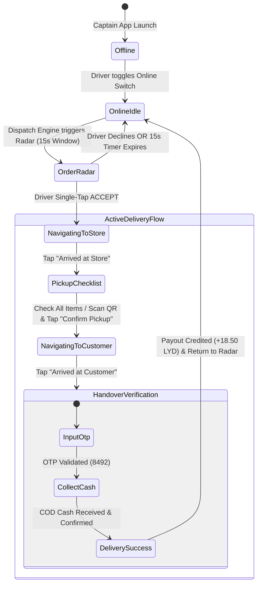

# Wasel Captain Driver App — Flutter Mobile Architecture & Design Specification

> **Enterprise Courier & Logistics Application (Libya Fleet Edition)**  
> Production-grade Flutter driver application powering food, quick-commerce grocery, and e-commerce delivery across Tripoli, Benghazi, and Misrata.

---

## 1. Executive Overview

The **Wasel Captain Driver App** provides captains and couriers with a high-contrast, sub-second latency toolset designed for active road navigation under intense daylight and dark night driving conditions.

Key capabilities include:
1. **Real-Time Order Radar with 15-Second Urgent Countdown**: Geospatial dispatching with instant LYD earnings preview, surge multipliers, and single-tap Accept/Decline actions.
2. **Active Step-by-Step Delivery State Machine**:
   - **Step 1**: Navigating to Store (Address, Call Store, GPS Navigation, "Arrived at Store").
   - **Step 2**: Order Pickup Confirmation (Item checklist & Merchant QR Code scanner).
   - **Step 3**: Navigating to Customer (Dropoff pin, Call Customer, Quick SMS templates).
   - **Step 4**: Complete Delivery (4-digit Customer OTP verification & COD Cash Collection Calculator).
3. **Driver Wallet & Double-Entry COD Ledger**:
   - Live tracking of Net Available Earnings vs. Cash-in-Hand COD Liability.
   - Platform COD Cash Deposit settlement via **Sadad Mobile Money**, **Tadawul**, and Platform Hubs.
   - Payout withdrawals directly to local Libyan banks and payment cards.
4. **Active Libyan Geofence Heat Map**:
   - Continuous surge monitoring across Tripoli (*Hai Al-Andalus, Gargarish, Downtown, Souq Al-Jumaa*) and Benghazi (*Al-Berka, Dubai St*).

---

## 2. Directory & Component Structure

```text
super_app_delivery/driver_app/
├── driver_theme.dart                 # High-contrast Day & OLED Night design tokens, Libyan Dinar (LYD) formatters
├── driver_models.dart                # Complete domain models: RadarOrder, ActiveDeliveryOrder, LedgerTransaction, DeliveryZone
├── simulated_driver_map.dart         # Custom-painted vector map canvas with dynamic routing, heading, and GPS telemetry
├── order_radar_dialog.dart           # High-urgency incoming dispatch popup with circular 15s timer and LYD breakdown
├── otp_input_field.dart              # 4-digit segmented customer OTP input with shake animation & error handling
├── cod_collection_sheet.dart         # Cash on Delivery modal with banknote shortcuts & exact change calculator
├── active_delivery_flow_screen.dart  # 4-step interactive delivery workflow (Store -> Checklist -> Customer -> Handover)
├── driver_wallet_screen.dart         # Dual-balance wallet, COD deposit request, bank payout withdrawals & ledger
├── driver_home_screen.dart           # Online/Offline switch, shift timer, performance stats, live zone surge heat map
├── main.dart                         # Runnable Flutter driver harness with bottom navigation & simulator triggers
└── README.md                         # Complete logistics documentation and system specifications
```

---

## 3. Order Lifecycle State Machine



---

## 4. Screen Breakdown & Logistics Features

### 4.1 Driver Home Screen (`driver_home_screen.dart`)
- **Online / Offline Pulsing Switch**: Instant toggle between `offline`, `online_idle`, and `busy_delivery`. Pulsing emerald ring indicates active GPS broadcasting.
- **Daily Performance Card**:
  - **Net Earnings Today**: e.g., `148.50 LYD` (+18% vs yesterday).
  - **Total Completed Trips**: e.g., `12 Trips`.
  - **Cash in Hand (COD Held)**: e.g., `215.00 LYD` with safety limit warning (`215 / 500 LYD`).
- **Live Libyan Delivery Zones & Surge**:
  - **Hai Al-Andalus & Gargarish (Tripoli)**: `1.6x Surge` (+5.50 LYD bonus / order).
  - **Tripoli Downtown & Ras Hassan**: `1.4x Surge` (+3.50 LYD bonus / order).
  - **Al-Berka & Dubai St (Benghazi)**: `1.5x Surge` (+4.00 LYD bonus / order).
- **Floating Radar Dispatch Simulator**: One-tap trigger to test real-time incoming dispatches.

---

### 4.2 Order Radar Dialog (`order_radar_dialog.dart`)
- **Circular 15-Second Countdown Timer**:
  - Continuous animated ring shifting from Green -> Amber -> Urgent Crimson (`<= 5s`).
  - Automatic decline upon expiry to maintain dispatch throughput.
- **Clear Financial Breakdown in LYD**:
  - Total Driver Payout: e.g., `18.50 LYD` (Base `12.00 LYD` + Surge `4.50 LYD` + Tip `2.00 LYD`).
- **Trip Geometry & Route Overview**:
  - Pickup Distance: `1.2 km` (~4 mins) to Store (*Smash Gourmet Burger*).
  - Dropoff Distance: `3.8 km` (~11 mins) to Customer (*Hai Al-Andalus*).
  - Total Trip: `5.0 km` (~15 mins).
- **Payment Method Badge**: Clear visual indicator if `Cash on Delivery (Collect 55.00 LYD)` vs `Sadad Prepaid`.

---

### 4.3 Active Delivery Flow (`active_delivery_flow_screen.dart`)
- **Step 1: Navigating to Store**:
  - Store phone hotline, Google Maps direct navigation intent, live prep time status (*"Ready in 3 mins"*), and *"I Have Arrived at Store"* button.
- **Step 2: Order Pickup Confirmation**:
  - Itemized checklist with modifier notes (*"2x Double Truffle Burger - Extra Cheddar"*).
  - QR Code Scanner overlay to scan merchant receipt barcode.
  - *"Confirm Pickup & Start Delivery"* button.
- **Step 3: Navigating to Customer**:
  - Customer contact actions (Direct Phone Call & Quick SMS Templates: *"Captain arriving in 2 mins"*).
  - Doorstep notes (*"Villa with blue gate. Please ring bell twice."*).
  - *"I Have Arrived at Customer"* button.
- **Step 4: Complete Delivery & Handover**:
  - **4-Digit Customer OTP Input** (`otp_input_field.dart`): Segmented PIN boxes with shake animation on incorrect entry (Demo PIN: `8492`).
  - **COD Cash Collection Sheet** (`cod_collection_sheet.dart`): Quick banknotes (`50 LYD`, `100 LYD`), change return calculator, and driver receipt confirmation.
  - **Completion Celebration Dialog**: Shows credited earnings and seamlessly returns captain to the Radar screen.

---

### 4.4 Driver Wallet & COD Ledger (`driver_wallet_screen.dart`)
- **Dual Financial Balances**:
  - **Net Available Earnings**: `348.50 LYD` available for withdrawal.
  - **Cash-in-Hand COD Liability**: `215.00 LYD` collected from customers.
  - **COD Limit Progress Bar**: Visual threshold bar alerting couriers to settle before reaching the `500 LYD` safety lock.
- **Platform COD Cash Deposit**:
  - Settle collected cash via **Sadad Mobile Money**, **Tadawul Card**, or Platform Cash Kiosks.
- **Payout Withdrawals to Local Payment Rails**:
  - Direct transfer to **Sadad Mobile**, **Tadawul Banking Cards**, and local Libyan Bank IBANs (*Jumhouria, Wahda, Sahara*).
- **Itemized Ledger Journal**:
  - Filter by `All`, `Earnings`, `COD`, and `Withdrawals`.

---

## 5. Libyan Telecommunications & Payment Integrations

| Provider | Type | Implementation & Role in Wasel Captain |
|:---|:---|:---|
| **Sadad (سداد)** | Mobile Payment & Cashout | Instant driver earnings withdrawal & COD platform settlement via `091xxxxxxx` / `092xxxxxxx` |
| **Tadawul (تداول)** | Financial Services & Cards | Direct bank card payouts and retail cash hub deposits |
| **Libyana & Al-Madar** | Telco SMS Gateway | Customer OTP SMS dispatch and Captain ETA arrival notifications |
| **Libyan Dinar (LYD)** | Currency Standard | High-visibility formatting (`XX.XX LYD`) across all driver earnings and COD collection modals |

---

## 6. How to Run the Prototype

To test and run the Driver App in Flutter:

```bash
# Navigate to the driver_app directory
cd C:\Users\kalifa\super_app_delivery\driver_app

# Run the Flutter App
flutter run main.dart
```

All screens and widgets use native Flutter SDK components with zero external dependency conflicts.
