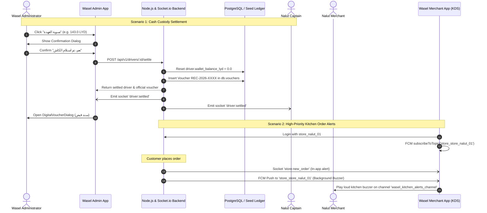

# Implementation Plan: Captain Cash Settlement & Merchant Order Notifications

**Feature**: `001-captain-settlement`  
**Plan Date**: 2026-09-27  
**Status**: Approved  

---

## 1. Architectural Strategy

---

## 2. Component Modifications

### A. Backend (`backend/server.js` & `backend/services/`)
1. **Endpoint `POST /api/v1/drivers/:id/settle`**:
   - Check driver existence in `db.drivers`.
   - Read `settledAmount = driver.wallet_balance_lyd || 0.0`.
   - Generate official voucher number: `REC-${year}-${suffix}`.
   - Insert voucher record into `db.vouchers` with:
     - `beneficiary_name: driver.full_name`
     - `beneficiary_role: 'captain'`
     - `amount_lyd: settledAmount`
     - `payment_method: 'cash'`
     - `notes: 'توريد عهدة نقدية (COD) واستلام الكاش وإبراء ذمة الكابتن'`
   - Save to persistent store (`saveSeedData()` and `saveVoucherToPg()`).
   - Zero out driver balance: `driver.wallet_balance_lyd = 0.0`.
   - Broadcast socket event `driver:settled` with payload `{ driver_id: driver.id, settled_amount: settledAmount, balance: 0.0, voucher }`.
   - Return `{ success: true, message: 'Driver cash settled successfully', data: driver, voucher }`.

### B. Merchant App (`flutter_merchant_app`)
1. **`lib/services/merchant_notification_service.dart`**:
   - Implement `Future<void> subscribeToStore(String storeId)`.
   - Implement `Future<void> unsubscribeFromStore(String storeId)`.
   - Normalize store topic naming: `store_${storeId.replaceAll('-', '_')}`.
2. **`lib/main.dart`**:
   - In `_initNotifications()`, call `await MerchantNotificationService().subscribeToStore(_currentStore.id)`.
   - On store logout / exit, call `MerchantNotificationService().unsubscribeFromStore(_currentStore.id)`.

### C. Admin App (`flutter_admin_app`)
1. **`lib/services/admin_supabase_service.dart`**:
   - Update `settleDriverCashWithVoucher(driver)` to consume the server's returned official voucher or fallback to local generated voucher on network disconnect.
2. **`lib/screens/captains_tab.dart`**:
   - Ensure the "تسوية العهدة" button renders disabled when `balance <= 0`.
   - Ensure dialog prevents duplicate clicks during asynchronous processing.

---

## 3. Verification & Testing Protocol

1. **Backend Integration Test**:
   - Verify `/api/v1/drivers/:id/settle` zeroes balance and returns voucher object.
   - Run `node backend/test_server.js` -> 100% pass.
2. **Static Analysis**:
   - `flutter analyze flutter_admin_app` -> 0 issues.
   - `flutter analyze flutter_merchant_app` -> 0 issues.
3. **Automated Unit & Widget Tests**:
   - `flutter test` in `flutter_admin_app`.
   - `flutter test` in `flutter_merchant_app`.
