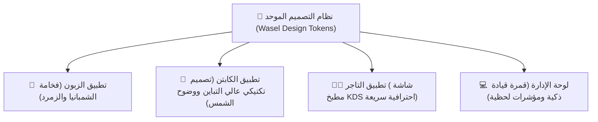

# Feature Specification: Unified Next-Gen App Redesign (واصل نالوت - الحلة الجديدة)

**Feature Branch**: `005-unified-app-redesign`  
**Created**: 2026-10-02  
**Status**: Design & Review Phase (قبل البدء البرمجي)  
**Input**: "باستخدام اداة سبكيت قم باعداد لخطة لاعادة الديزاين للتطبيقات بحلتها الجديدة قبل البدء قم باعطائي نموذج او من الشاشات"

---

## 🎨 1. Executive Summary & Design Vision

يهدف مشروع "الحلة الجديدة" لمنظومة **واصل نالوت** إلى ترقية التجربة البصرية والحسية لتطبيقات المنظومة الأربعة (تطبيق الزبون، تطبيق الكابتن، تطبيق التاجر، ولوحة الإدارة) من مجرد واجهات خدمية عادية إلى **نظام بصري استثنائي فائق الفخامة (Royal Berber & Mediterranean Luxury)** يعبر عن هوية جبل نفوسة العريقة وعراقة مدينة نالوت مع لمسات المودرن غلاسمورفيزم (Glassmorphism) وعناصر التفاعل اللحظي السلس.

---

## 🏛️ 2. الركائز البصرية للديزاين الجديد (Design Pillars)

### 💎 أ) لوحة الألوان السيادية (Color Palette):
1. **الزمرد الليلي العميق (`#041710` - Canvas)**:
   - خلفيات عميقة ومريحة للعين في الاستخدام الليلي والنهاري، تمنح شعوراً بالفخامة والاتساع.
2. **الذهب المعتق والراديانس (`#D4AF37` / `#F5D061` - Gold Accent)**:
   - أزرار الحجز والطلب، شارات العروض الساخنة، مؤشرات التقييم، وشارات التميز.
3. **عاج الشمبانيا (`#F8F5EE` - Primary Text)**:
   - نصوص ناصعة وقابلة للقراءة بوضوح تام دون توهج الأبيض الحاد المجهد للعين.
4. **أخضر الإنجاز المضيء (`#10B981` - Neon Emerald)**:
   - الحالات الحية، مؤشرات التوصيل المباشر، وتأكيدات التسليم الناجح.
5. **كهرمان نالوت (`#F59E0B` - Amber Glow)**:
   - طلبات قيد الطهي، تنبيهات الرادار، والمهمات المستعجلة.

---

### ✨ ب) العناصر التفاعلية والميكرو-أنيميشن (Micro-Interactions):
- **Glassmorphic Cards**: بطاقات زجاجية مع بلور خفيف (`backdrop-filter: blur(12px)`) وحدود ناعمة شبه شفافة (`rgba(212, 175, 55, 0.15)`).
- **Haptic & Dynamic Spring Animations**: استجابة فورية ونبضات حيوية (Pulse Glow) عند ورود طلب جديد أو حركة الكابتن.
- **Large Ergonomic Tap Targets**: أزرار كبرى (ارتفاع 54px - 60px) لضمان سهولة الاستخدام بيد واحدة في السيارة أو أثناء الطهي في المطبخ.

---

## 📱 3. هوية الشاشات في الحلة الجديدة لكل تطبيق

### 1. تطبيق الزبون (`Wasel Customer App`):
- **الهيدر التفاعلي الذكي**: ترحيب مخصص، محدد عنوان التوصيل الحي بنقرة واحدة، ومؤشر رصيد المحفظة ونقاط الولاء.
- **قصص وعروض المتاجر التفاعلية (Instagram-like Stories)**: شريط عروض ساخنة مع عدادات تنازلية حية للخصومات المحدودة.
- **شبكة المطاعم والأصناف بتصميم المجلة المصورة**: بطاقات عريضة بصور عالية الجودة، شارات التقييم والوقت التقريبي وسعر التوصيل بالدينار الليبي (`د.ل`).
- **شريط التنقل السفلي العائم (Floating Dock Navigation)**: شريط زجاجي عائم يندمج مع تتبع الطلب النشط تلقائياً.

### 2. تطبيق الكابتن (`Wasel Captain App`):
- **الوضع التكتيكي الميداني (Tactical Field Mode)**: تباين عالي جداً لمقاومة انعكاس أشعة الشمس أثناء القيادة في جبال نالوت.
- **بطاقة الرادار والطلب الوارد**: عداد دائري نبضي مشرق يبين المطعم، المسافة، الصافي المتوقع للكابتن، وزر السحب للتأكيد (Swipe to Accept).
- **مخطط سير الرحلة التفاعلي (4-Step Flow)**: إرشادات واضحة لا لبس فيها، أزرار استلام كبرى، وتأكيد كود التسليم OTP بلمسة واحدة.

### 3. تطبيق التاجر والمطبخ (`Wasel Merchant KDS App`):
- **تذاكر الطهي الحية (High-Speed Kitchen Tickets)**: بطاقات طلب بألوان متدرجة تميز الوقت المنقضي (أخضر ➔ أزرق ➔ كهرماني ➔ أحمر عند التأخير).
- **مؤشر وصول الكابتن المتكامل**: تنبيه فوري بصوت مميز فور وقوف الكابتن أمام المطعم لمنع برود الوجبات.
- **معاينة الإيصال الحراري الفوري**: طباعة إيصالات البلوتوث بضغطة زر واحدة.

### 4. تطبيق الإدارة والعمليات (`Wasel Admin App`):
- **قمرة القيادة الشاملة (Executive Cockpit)**: بطاقات إحصائية بالسيولة النقدية (COD) المحصلة، عدد الرحلات المنجزة، والطلبات النشطة.
- **خريطة الرادار الفضائية لكباتن نالوت**: تتبع حي للأيقونات مع حالة الكابتن (متاح / مشغول / أوفلاين).

---

## 👥 4. User Scenarios & Prioritized User Stories

### User Story 1 - Customer Delight & Effortless Discovery (Priority: P1)
**User Persona**: زبون في نالوت يتصفح عشاء الليلة.  
**Scenario**: يفتح التطبيق فيرى شريط العروض الساخنة بحلة ملكية أنيقة، يختار وجبته وتظهر الفاتورة بالدينار الليبي بوضوح تام، مع إمكانية التتبع بنقرة زر.

### User Story 2 - Driver Ergonomics & Sunlit Readability (Priority: P1)
**User Persona**: كابتن واصل يقود سيارته في ظهيرة مشمسة في نالوت.  
**Scenario**: ورود طلب جديد بأزرار واضحة وخطوط عريضة تسمح باتخاذ القرار في ثوانٍ وتوجيهه نحو المطعم دون تشتيت.

### User Story 3 - Merchant High-Pressure Kitchen Clarity (Priority: P1)
**User Persona**: طاهي في مطعم شاورما أو بيتزا في وقت الذروة.  
**Scenario**: شاشة KDS منظمة بنظام الكروت الكبيرة التي تقاوم الانشغال وتظهر كود التسليم OTP بوضوح لا يقبل اللبس.

---

## 📋 5. خطة التنفيذ المرحلية (Roadmap)

1. **المرحلة 1**: اعتماد النماذج التفاعلية للشاشات من قبل المستخدم (عبر المعاينة المباشرة المرفقة).
2. **المرحلة 2**: تحديث ملفات الثيم ونظام الألوان الموحد (`wasel_theme.dart` / `app_colors.dart`) عبر التطبيقات.
3. **المرحلة 3**: إعادة تشكيل الواجهات الأساسية لتطبيق الزبون (الرئيسية، تفاصيل المتجر، السلة، والتتبع).
4. **المرحلة 4**: ترقية شاشات تطبيق الكابتن والمطبخ بلوحة التحكم الجديدة.
5. **المرحلة 5**: الفحوصات الجمالية والوظيفية وبناء حزم APK المحدثة بالحلة الجديدة.
