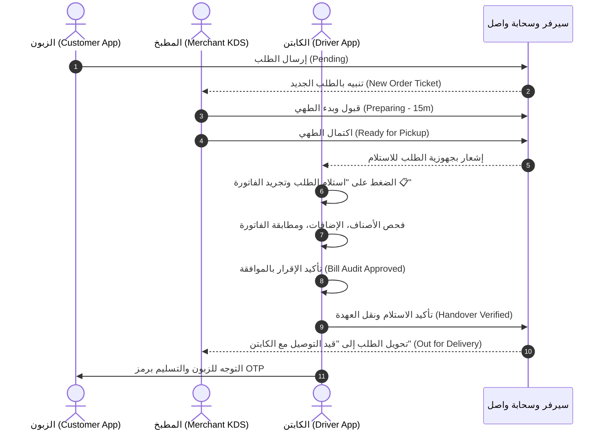

# Implementation Plan: Order Lifecycle Handover Audit & Modern Kitchen App Redesign

**Spec**: [spec.md](file:///c:/Users/kalifa/Desktop/wasel-app/specs/006-order-handover-audit-and-kds-redesign/spec.md)  
**Branch**: `006-order-handover-audit-and-kds-redesign`  
**Status**: In Progress  

---

## 🏗️ 1. Technical Context & State Machine

---

## 🎨 2. Component Design & Touchpoints

### Phase 1: Driver App Handover & Bill Audit (`flutter_driver_app`)
- **File**: `flutter_driver_app/lib/active_delivery_flow_screen.dart`
- **State**:
  - `bool _isBillAudited = false;` (هل تم تجريد الفاتورة ومطابقة الأصناف؟)
  - `bool _isBillAuditApproved = false;` (هل وافق الكابتن على استلام الأصناف؟)
- **UI Components**:
  - `_showBillAuditBottomSheet()`: مودال منبثق فخم يعرض الفاتورة التفصيلية:
    - تفاصيل المتجر والطلب والوقت.
    - قائمة تفاعلية بالأصناف مع الكميات وملاحظات الطهي الخاصة.
    - ملخص الحساب (قيمة الطعام + التوصيل + الإجمالي بالدينار الليبي).
    - صندوق موافقة تفاعلي: *"أوافق وأقر بأنني فحصت الفاتورة واستلمت كامل الأصناف سليمة من المطعم"*.
    - زر تأكيد وموافقة ينقل الكابتن فوراً إلى مرحلة الاستلام النهائي.
  - زر الاستلام السفلي:
    - إذا لم يتم التجريد: `"استلام الطلب وفحص الفاتورة 📋"` (يفتح المودال).
    - بعد الموافقة: `"تأكيد الاستلام والانطلاق للزبون 🛵"` (يُحدث السيرفر ويقفل العهدة).

---

### Phase 2: Merchant Kitchen App Auto-Identification (`flutter_merchant_app`)
- **Files**:
  - `flutter_merchant_app/lib/merchant_theme.dart`: التأكد من وجود ثيم فاتح كامل (`lightTheme`) مع خلفيات بيضاء كلاسيكية ناصعة وظلال لطيفة.
  - `flutter_merchant_app/lib/merchant_login_screen.dart`: تحويل الشاشة إلى **"بوابة تحديد متجر نالوت الذاتية"**:
    - بدلاً من إجبار المستخدم على حفظ وكتابة رقم هاتف ورمز سري كل مرة:
      - عرض بطاقات المتاجر المعتمدة في نالوت (مطعم رانشيلو نالوت 🌯، ريكسوس للتسوق 🛒، قصر نالوت للمشويات 🥩، مخبز الجبل 🥐).
      - الضغط على أي متجر يقوم بتسجيل الدخول فوراً وبشكل دائم في ثانية واحدة (1-Tap Instant Identify & Lock).
      - دعم إمكانية تسجيل الدخول المخصص بالهاتف والرمز أيضاً.
  - `flutter_merchant_app/lib/main.dart`:
    - ضبط الثيم على الثيم الفاتح الافتراضي.
    - زر في الشريط العلوي لتغيير أو تبديل المتجر بضغطة زر واحدة (Store Switcher).

---

### Phase 3: Kitchen Display System (KDS) Full Modern Redesign (`flutter_merchant_app`)
- **File**: `flutter_merchant_app/lib/kds_screen.dart`
- **UI Transformations**:
  - خلفية السطح: استبدال `MerchantColors.darkBg` (`#0F172A`) بخلفية سحابية بيضاء مريحة (`#F8FAFC`).
  - بطاقات التذاكر:
    - خلفية بيضاء نقية (`#FFFFFF`) مع ظلال ناعمة (`0 4px 20px rgba(0,0,0,0.04)`).
    - شريط علوي بلون الحالة التشغيلية (أصفر كهرماني دافئ للطلبات الجديدة، أزرق طهي، وأخضر زمردي للجاهز).
    - نصوص داكنة حادة عالية التباين (`#0F172A`) بدلاً من الأبيض على الداكن.
    - خانات الأصناف بخلفيات خفيفة واضحة ومقروءة لطاقم المطبخ.
    - مؤقت طهي متدرج ومتحرك مع بادج حالة الطلب بالدينار الليبي (`د.ل`).

---

## 🧪 3. Verification & Test Plan

1. **Unit & Widget Tests**:
   - اختبار تدفق تجريد الفاتورة في تطبيق الكابتن والتأكد من منع انتقال العهدة دون موافقة.
   - اختبار حفظ وتحديد المتجر في تطبيق المطبخ واستعادته عند إعادة التشغيل.
2. **Static Analysis**:
   - تشغيل `flutter analyze` على كافة التطبيقات والتأكد من خلوها من أي مشاكل (0 errors, 0 warnings).
3. **Build & Release Deployment**:
   - إعادة تجميع حزم الـ APKs لكافة التطبيقات المتأثرة (`Wasel_Customer_App.apk`, `Wasel_Captain_App.apk`, `Wasel_Merchant_App.apk`).
