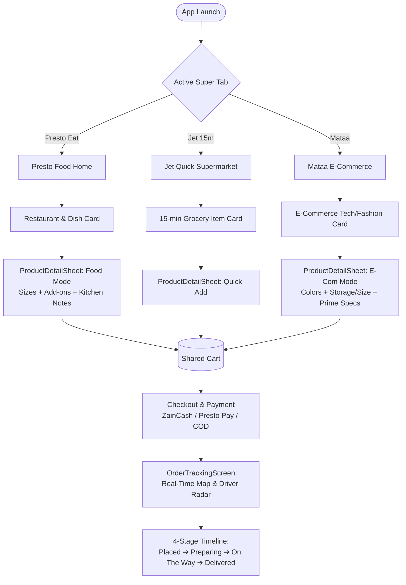
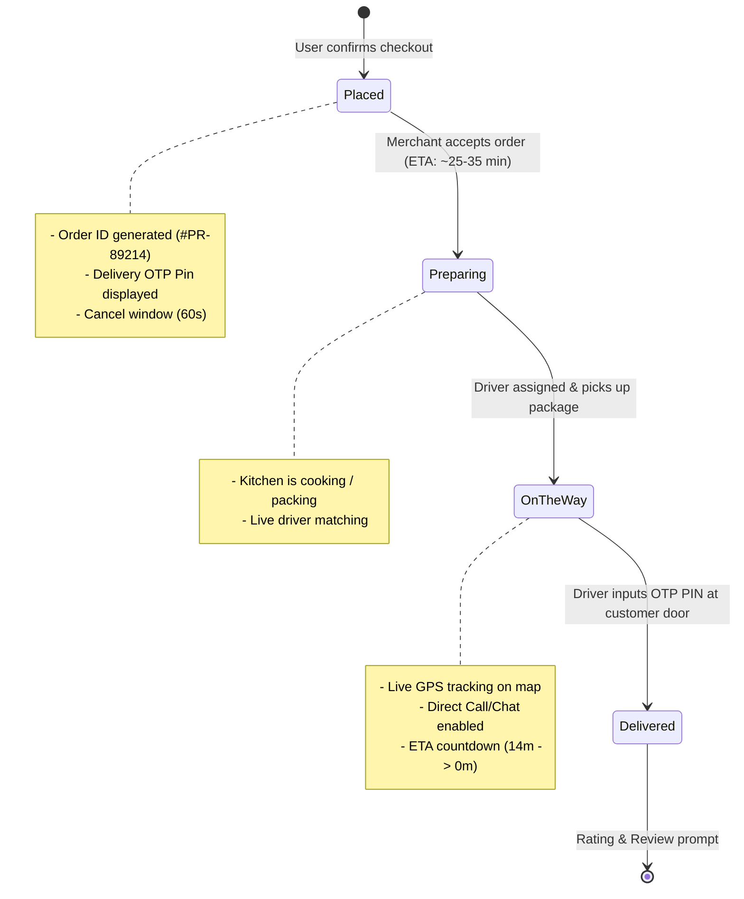

# Presto x Mataa Super-App — UI/UX Design System & Architecture Specification

> **Super-App Mobile Design System & Production Flutter UI Prototypes**  
> Bridging **Presto Eat** (Food Delivery), **Jet Express** (15-min Ultra-fast Grocery), and **Mataa Marketplace** (Lifestyle & Tech E-Commerce).

---

## 1. Executive Summary & Design Vision

The **Presto x Mataa Super-App** combines high-frequency everyday commerce into a unified mobile interface:
1. **Presto Eat**: High-energy restaurant discovery and food delivery (Crimson Red `#E23744` & Sunset Orange `#FF6600`).
2. **Jet Express**: Ultra-fast 15-minute essentials and grocery fulfillment (Emerald Green `#10B981` & Fresh Mint `#D1FAE5`).
3. **Mataa Marketplace**: Premium lifestyle, electronics, perfumes, and multi-category e-commerce (Royal Purple `#7C3AED` & Midnight Navy `#0F172A`).

The design prioritizes **sub-second navigation**, **zero-latency context switching**, **visual clarity across dense product catalogs**, and **interactive live order visibility**.

---

## 2. File & Prototype Structure

```text
super_app_delivery/ui_ux/
├── design_system.dart          # Central design tokens: Colors, Typography, Spacing, Radius, Themes (Light/Dark), Primitives
├── home_screen.dart            # Hybrid Super-App Home Screen with dynamic Brand Tab Switcher, Promo Banners, Categories & Grids
├── order_tracking_screen.dart  # Real-time Order Tracking with simulated vector map, driver marker, step timeline, OTP PIN
├── product_detail_sheet.dart   # Dual-mode Modal BottomSheet for Food Modifiers (addons/sizes) & E-Commerce Variants (color/storage)
├── main.dart                   # Runnable Flutter prototype entry point with Light/Dark mode toggling
└── README.md                   # Complete UI/UX Documentation, User Flows, Wireframes & Token Architecture
```

---

## 3. Design System Tokens (`design_system.dart`)

### 3.1 Brand Color Palette

| Token Name | Hex Code | Purpose & Semantic Role |
|:---|:---|:---|
| `AppColors.prestoPrimary` | `#E23744` | Signature Presto Red — High conversion CTAs, food badges, flash deals |
| `AppColors.prestoSecondary` | `#FF6600` | Zesty Sunset Orange — Secondary accents, promo badges, gradient blend |
| `AppColors.prestoAccent` | `#FF1E56` | Flash Deal Crimson — Timer countdowns, limited offer highlights |
| `AppColors.mataaPrimary` | `#7C3AED` | Royal Electric Violet — Marketplace branding, Prime tags, tech products |
| `AppColors.mataaSecondary` | `#6366F1` | Indigo Pulse — E-commerce buttons, category icons |
| `AppColors.mataaNavy` | `#0F172A` | Midnight Slate Navy — Premium headers, luxury badges, dark surfaces |
| `AppColors.jetPrimary` | `#10B981` | Express Emerald — 15-minute quick delivery tag, supermarket deals |
| `AppColors.jetSecondary` | `#059669` | Deep Forest — Success states, fresh organic food tags |
| `AppColors.jetAccent` | `#06B6D4` | Lightning Cyan — Jet gradient end-stop, rapid delivery indicators |
| `AppColors.gold` | `#FFB800` | Luxury star rating, VIP tier badge, verified seller emblem |

### 3.2 Neutral Palette (Light & Dark)

| Token Name | Light Theme | Dark Theme | Role |
|:---|:---|:---|:---|
| `Background` | `#F8FAFC` (Slate 50) | `#0B0F19` (Deep Charcoal) | Canvas background |
| `Surface` | `#FFFFFF` | `#131B2E` (Navy Slate) | App bar, Bottom bar, Bottom sheet |
| `Card` | `#FFFFFF` | `#1E293B` (Slate 800) | Item cards, restaurant containers |
| `Border` | `#E2E8F0` | `#334155` (Slate 700) | Card outlines, dividers |
| `TextPrimary` | `#0F172A` (Slate 900) | `#F8FAFC` (Slate 50) | Main headlines, titles, prices |
| `TextSecondary` | `#475569` (Slate 600) | `#94A3B8` (Slate 400) | Subtitles, meta info, descriptions |
| `TextMuted` | `#94A3B8` (Slate 400) | `#64748B` (Slate 500) | Timestamps, search placeholder text |

### 3.3 Typography Scale (Plus Jakarta Sans)

- **Display Large**: 32pt / Bold (800) / Tracking: -0.8px / Line Height: 1.2
- **Display Medium**: 28pt / Bold (700) / Tracking: -0.5px / Line Height: 1.25
- **Headline Large**: 22pt / Bold (700) / Tracking: -0.4px / Line Height: 1.3
- **Headline Medium**: 18pt / SemiBold (700) / Tracking: -0.2px / Line Height: 1.35
- **Title Large**: 16pt / SemiBold (600) / Tracking: -0.1px / Line Height: 1.4
- **Title Medium**: 14pt / SemiBold (600) / Line Height: 1.4
- **Body Large**: 15pt / Regular (400) / Line Height: 1.5
- **Body Medium**: 13pt / Regular (400) / Line Height: 1.5
- **Body Small**: 12pt / Regular (400) / Line Height: 1.4
- **Label Large**: 14pt / Bold (600) / Tracking: 0.1px (Button CTAs)
- **Label Medium**: 12pt / SemiBold (600) / Tracking: 0.1px (Badges & Chips)
- **Label Small**: 10pt / ExtraBold (700) / Tracking: 0.3px (Pill tags)
- **Mono Number**: 14pt-20pt / RobotoMono Bold (Order IDs, PINs, ETA)

### 3.4 Spacing & Geometry (8-Point Grid)

- `AppSpacing.xs`: 4px | `sm`: 8px | `md`: 12px | `lg`: 16px | `xl`: 20px | `xxl`: 24px | `xxxl`: 32px
- `AppRadius.sm`: 8px | `md`: 12px | `lg`: 16px | `xl`: 20px | `xxl`: 28px | `full`: 999px (Pills/Circles)

---

## 4. Information Architecture & Navigation



---

## 5. Screen Breakdown & UI/UX Patterns

### 5.1 Hybrid Super-App Home Screen (`home_screen.dart`)

```text
┌────────────────────────────────────────────────────────────┐
│ 📍 Delivering to: Al-Mansour, Baghdad  [15 MIN]  🔔  🛍️ (3)│  <-- Header
├────────────────────────────────────────────────────────────┤
│ ( 🍔 Presto Eat )   ( ⚡ Jet 15m )   ( 🛍️ Mataa Market )    │  <-- Brand Switcher
├────────────────────────────────────────────────────────────┤
│ 🔍 Search restaurants, burgers, gadgets...               🎛️ │  <-- Dynamic Search
├────────────────────────────────────────────────────────────┤
│ ┌────────────────────────────────────────────────────────┐ │
│ │ 🔥 FLASH DEAL (PRESTO50)                                │ │  <-- Promo Banner
│ │ Up to 50% OFF Top Eateries & Combos                    │ │
│ └────────────────────────────────────────────────────────┘ │
├────────────────────────────────────────────────────────────┤
│ [Burgers]  [Shawarma]  [Pizza]  [Iraqi Grill]  [Sweets]   │  <-- Categories
├────────────────────────────────────────────────────────────┤
│ 🛵 Driver on the way • Arriving in 14 mins        [TRACK >]│  <-- Live Mini-Bar
├────────────────────────────────────────────────────────────┤
│ 🍽️ Trending Restaurants (Al-Mansour)                       │
│ ┌────────────────────────────────────────────────────────┐ │
│ │ [HERO BANNER: Smash Triple Burger Co.]     ⭐ 4.9 (1.4k)│ │
│ │ American Gourmet Burgers • 18-25 min • Free Delivery   │ │
│ │ Special: Smash Triple Wagyu Burger        [ $12.50  + ]│ │
│ └────────────────────────────────────────────────────────┘ │
└────────────────────────────────────────────────────────────┘
```

#### UX Highlights:
1. **Dynamic Brand Segmented Control**: Instantly changes the search placeholder, category taxonomy, promotional banners, theme accents, and product feeds with zero page reloads.
2. **Sticky Live Order Mini-Bar**: Whenever an order is active, users see a high-contrast floating tracker at the top of the feed that jumps directly into the map view with one tap.
3. **Optimized Quick-Add Workflows**: Food items and grocery cards offer direct `+` tap actions opening the contextual modifier sheet.

---

### 5.2 Real-Time Order Tracking Screen (`order_tracking_screen.dart`)

```text
┌────────────────────────────────────────────────────────────┐
│ ‹ Live Tracking #PR-89214              [ ⏩ Advance Step ] │
├────────────────────────────────────────────────────────────┤
│                                                            │
│       [ 🏪 Smash Burger ]                                  │
│             \                                              │
│              \~~~~~ ( 🛵 Driver Marker + Radar Pulse )    │
│                     \                                      │
│                      \~~~~~ [ 🏠 Home: You ]               │
│                                                            │
├────────────────────────────────────────────────────────────┤
│ ╭────────────────────────────────────────────────────────╮ │
│ │ ESTIMATED ARRIVAL: 14 mins             DELIVERY PIN    │ │
│ │ Captain Ali is 1.8 km away             [ 8 4 9 2 ]     │ │
│ ╰────────────────────────────────────────────────────────╯ │
│                                                            │
│  (✓) Placed ─── (✓) Preparing ─── (●) On The Way ─── ( ) Del │
│                                                            │
│ ┌────────────────────────────────────────────────────────┐ │
│ │ 👤 Captain Ali Al-Iraqi  ⭐ 4.95        [ 💬 Chat ]    │ │
│ │ Yamaha MT-07 • BAG 4819                 [ 📞 Call ]    │ │
│ └────────────────────────────────────────────────────────┘ │
│                                                            │
│ ▼ Order Items (3 items)                         $28.50     │
│   • 2x Smash Triple Wagyu Burger ($23.00)                  │
│   • 1x Crispy Truffle Fries ($3.50)                        │
│   • 1x Passion Fruit Sparkling Cooler ($2.00)              │
│   Payment: ZainCash (Paid)                                 │
└────────────────────────────────────────────────────────────┘
```

#### UX Highlights:
1. **Simulated Vector Map Canvas (`_MapRoutePainter`)**: Custom-painted cubic bezier route connecting the merchant and delivery destination with a real-time moving motorcycle marker and animated pulsing radar waves.
2. **Delivery Security PIN**: High-contrast OTP (`8492`) presented prominently to verify delivery handover and prevent misdeliveries.
3. **Interactive Step Simulator**: Built-in `Advance Step` tool allows product teams and developers to simulate all 4 delivery states (`Placed` ➔ `Preparing` ➔ `OnTheWay` ➔ `Delivered`) instantly.

---

### 5.3 Dual-Mode Product Detail Sheet (`product_detail_sheet.dart`)

#### Mode A: Food Customization (Presto Eat & Jet)
- **Required Radio Groups**: Single Choice (e.g., *Regular Single*, *Double Patty +$3.50*, *Triple Wagyu Beast +$6.50*).
- **Multi-Select Modifiers**: Checkboxes with individual prices (*Extra Truffle Mayo +$1.50*, *Crispy Smoked Beef Bacon +$2.25*, *Pickled Jalapeños +$0.75*).
- **Kitchen Special Notes**: Text input for allergy notes or custom preferences.

#### Mode B: E-Commerce Variants (Mataa Marketplace)
- **Color Swatch Selector**: Interactive circular swatches (*Space Black*, *Titanium Blue*, *Natural Titanium*, *Desert Gold*).
- **Specification Chips**: Storage/Size capacity chips (*128GB*, *256GB +$100*, *512GB +$240*, *1TB +$420*).
- **Trust & Assurance Badges**: *100% Genuine Authenticity*, *1-Year Official Warranty*, *Mataa Prime 24h Delivery*.

#### Dynamic Sticky Bottom Checkout Bar:
- Smooth quantity stepper (`-` `[Qty]` `+`).
- Live instantaneous price recalculation (`Total = (Base + Size + Addons) * Qty`).
- Animated CTA button (`Add • $XX.XX`) with custom brand gradients.

---

## 6. Order Lifecycle State Machine



---

## 7. Localization & Accessibility (RTL + LTR)

### 7.1 Arabic (RTL) & English (LTR) Adaptations
- **Directionality Support**: All horizontal layouts utilize start/end alignment semantics (`AlignmentDirectional`), enabling seamless RTL mirroring for Iraqi Arabic locales.
- **Arabic Numerals & Monospace Codes**: Critical identifiers (Delivery PIN `8492`, Order `#PR-89214`, Phone numbers) maintain left-to-right digit formatting within RTL contexts using `AppTypography.monoNumber`.

### 7.2 Accessibility Standards (WCAG 2.1 AA)
- **Touch Target Size**: All interactive buttons, icon buttons, radio tiles, and stepper chips have a minimum bounding box of **48x48 dp**.
- **Color Contrast**: 
  - Primary button text against `#E23744` / `#7C3AED` yields contrast ratio **> 4.6:1** (Passes AA).
  - Dark mode surfaces use `#1E293B` against `#F8FAFC` text yielding contrast ratio **> 12:1** (Passes AAA).

---

## 8. Quick Start & Execution

To preview and interact with the design system and screen prototypes in Flutter:

```bash
# Navigate to the workspace
cd C:\Users\kalifa\super_app_delivery\ui_ux

# Run the Flutter demo app
flutter run lib/main.dart  # or with main.dart in current folder
```

All screens have zero external dependencies beyond standard Flutter SDK (`package:flutter/material.dart`), ensuring zero-friction integration into your mobile codebase.
